# Capstone-Engine API Documentation

| Version | 4.0.2 |
| ------- | ----- |

**Official API document by [kabeor](https://github.com/kabeor)**

[Capstone Engine](https://github.com/capstone-engine/capstone)是一个支持多种硬件架构的二进制反汇编引擎。


## 0x0 开发准备 

  Capstone官网： http://www.capstone-engine.org

### 自行编译lib和dll方法

  源码： https://github.com/capstone-engine/capstone.git

  git clone下来
  文件结构如下：

```
   .                <- 主要引擎core engine + README + 编译文档COMPILE.TXT 等
├── arch            <- 各语言反编译支持的代码实现
│   ├── AArch64     <- ARM64 (aka ARMv8) 引擎
│   ├── ARM         <- ARM 引擎
│   ├── EVM         <- Ethereum 引擎
│   ├── M680X       <- M680X 引擎
│   ├── M68K        <- M68K 引擎
|   ├── MOS65XX     <- MOS65XX 引擎
│   ├── Mips        <- Mips 引擎
│   ├── PowerPC     <- PowerPC 引擎
│   ├── Sparc       <- Sparc 引擎
│   ├── SystemZ     <- SystemZ 引擎
│   ├── TMS320C64x  <- TMS320C64x 引擎
│   ├── X86         <- X86 引擎
│   └── XCore       <- XCore 引擎
├── bindings        <- 绑定
│   ├── java        <- Java 绑定 + 测试代码
│   ├── ocaml       <- Ocaml 绑定 + 测试代码
│   ├── powershell  <- powershell 绑定 + 测试代码
│   ├── python      <- python 绑定 + 测试代码
│   └── vb6         <- vb6 绑定 + 测试代码
├── contrib         <- 社区代码
├── cstool          <- Cstool 检测工具源码
├── docs            <- 文档，主要是capstone的实现思路
├── include         <- C头文件
├── msvc            <- Microsoft Visual Studio 支持（Windows）
├── packages        <- Linux/OSX/BSD包
├── suite           <- 项目开发所需工具
├── tests           <- C语言测试用例
├── windows         <- Windows 支持(Windows内核驱动编译)
├── windowsce       <- Windows CE 支持
└── xcode           <- Xcode 支持 (MacOSX 编译)
```

下面演示Windows10使用Visual Studio2019编译

复制msvc文件夹到一个比较清爽的位置，内部结构如下：


VS打开capstone.sln项目文件，解决方案自动载入这些

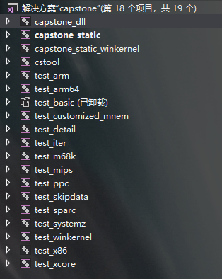

可以看到支持的所有语言都在这里了，如果都需要的话，直接编译就好了，只需要其中几种，则右键解决方案->属性->配置属性  如下

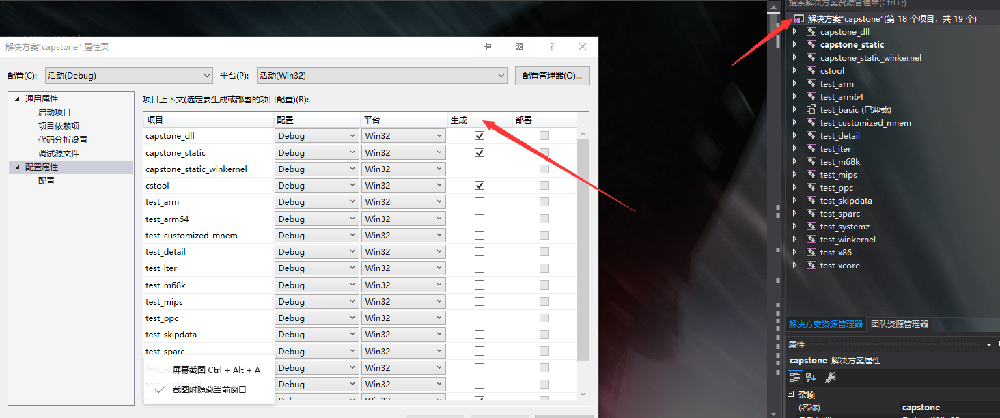

生成选项中勾选你需要的支持项即可
编译后会在当前文件夹Debug目录下生成capstone.lib静态编译库和capstone.dll动态库这样就可以开始使用Capstone进行开发了

如果不想自己编译，官方也提供了官方编译版本

Win32： https://github.com/capstone-engine/capstone/releases/download/4.0.2/capstone-4.0.2-win32.zip

Win64： https://github.com/capstone-engine/capstone/releases/download/4.0.2/capstone-4.0.2-win64.zip

选x32或x64将影响后面开发的位数


### 引擎调用测试

新建一个VS项目，将capstone\include\capstone中的头文件以及编译好的lib和dll文件全部拷贝到新建项目的主目录下


在VS解决方案中，头文件添加现有项capstone.h，资源文件中添加capstone.lib，重新生成解决方案

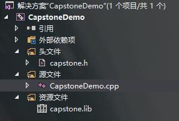

那么现在来测试一下我们自己的capstone引擎吧

主文件写入如下代码

<details><summary> Code </summary>

```c++
#include <iostream>
#include <stdio.h>
#include <cinttypes>  
#include "capstone.h"
using namespace std;

#define CODE "\x55\x48\x8b\x05\xb8\x13\x00\x00"

int main(void)
{
	csh handle;
	cs_insn* insn;
	size_t count;

	if (cs_open(CS_ARCH_X86, CS_MODE_64, &handle)) {
		printf("ERROR: Failed to initialize engine!\n");
		return -1;
	}

	count = cs_disasm(handle, (unsigned char*)CODE, sizeof(CODE) - 1, 0x1000, 0, &insn);
	if (count) {
		size_t j;

		for (j = 0; j < count; j++) {
			printf("0x%""Ix"":\t%s\t\t%s\n", insn[j].address, insn[j].mnemonic, insn[j].op_str);
		}

		cs_free(insn, count);
	}
	else
		printf("ERROR: Failed to disassemble given code!\n");

	cs_close(&handle);

	return 0;
}
```

</details>

运行结果
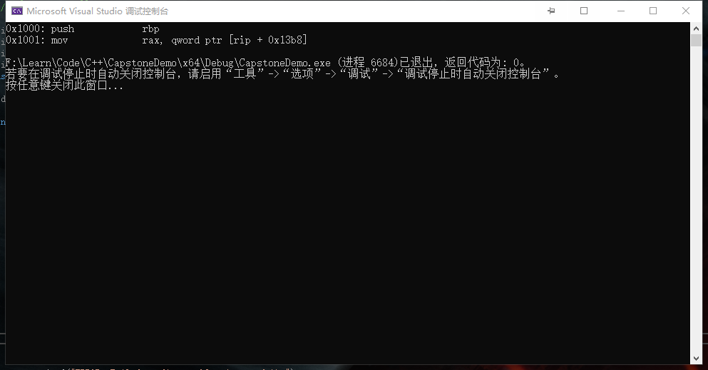


## 0x1 数据类型

### csh

用于生成调用capstone API的句柄 

```cpp
size_t csh
```

> 用法： `csh handle;`


### cs_arch

架构选择

<details><summary> Code </summary>

```cpp
 enum cs_arch {
	CS_ARCH_ARM = 0,	///< ARM 架构 (包括 Thumb, Thumb-2)
	CS_ARCH_ARM64,		///< ARM-64, 也叫 AArch64
	CS_ARCH_MIPS,		///< Mips 架构
   CS_ARCH_X86,		///< X86 架构 (包括 x86 & x86-64)
	CS_ARCH_PPC,		///< PowerPC 架构
	CS_ARCH_SPARC,		///< Sparc 架构
	CS_ARCH_SYSZ,		///< SystemZ 架构
	CS_ARCH_XCORE,		///< XCore 架构
	CS_ARCH_M68K,		///< 68K 架构
	CS_ARCH_TMS320C64X,	///< TMS320C64x 架构
	CS_ARCH_M680X,		///< 680X 架构
	CS_ARCH_EVM,		///< Ethereum 架构
	CS_ARCH_MAX,
	CS_ARCH_ALL = 0xFFFF, // All 架构 - for cs_support()
} cs_arch;
```

</details>

> 用法：API中cs_arch参数填入枚举内容，如API中cs_open(cs_arch arch, cs_mode mode, csh *handle);第一个参数填CS_ARCH_X86则支持X86 架构


### cs_mode

模式选择

<details><summary> Code </summary>

```cpp
enum cs_mode {
	CS_MODE_LITTLE_ENDIAN = 0,	             ///< little-endian 模式 (default 模式)
	CS_MODE_ARM = 0,	                     ///< 32-bit ARM
	CS_MODE_16 = 1 << 1,	                 ///< 16-bit 模式 (X86)
	CS_MODE_32 = 1 << 2,	                 ///< 32-bit 模式 (X86)
	CS_MODE_64 = 1 << 3,	                 ///< 64-bit 模式 (X86, PPC)
	CS_MODE_THUMB = 1 << 4,	                 ///< ARM's Thumb 模式, 包括 Thumb-2
	CS_MODE_MCLASS = 1 << 5,	             ///< ARM's Cortex-M 系列
	CS_MODE_V8 = 1 << 6,	                 ///< ARMv8 A32解码方式
	CS_MODE_MICRO = 1 << 4,                  ///< MicroMips 模式 (MIPS)
	CS_MODE_MIPS3 = 1 << 5,                  ///< Mips III ISA
	CS_MODE_MIPS32R6 = 1 << 6,               ///< Mips32r6 ISA
	CS_MODE_MIPS2 = 1 << 7,                  ///< Mips II ISA
	CS_MODE_V9 = 1 << 4,                     ///< SparcV9 模式 (Sparc)
	CS_MODE_QPX = 1 << 4,                    ///< Quad Processing eXtensions 模式 (PPC)
	CS_MODE_SPE = 1 << 5,                    ///< Signal Processing Engine 模式 (PPC)
	CS_MODE_BOOKE = 1 << 6,                  ///< Book-E 模式 (PPC)
	CS_MODE_M68K_000 = 1 << 1,               ///< M68K 68000 模式
	CS_MODE_M68K_010 = 1 << 2,               ///< M68K 68010 模式
	CS_MODE_M68K_020 = 1 << 3,               ///< M68K 68020 模式
	CS_MODE_M68K_030 = 1 << 4,               ///< M68K 68030 模式
	CS_MODE_M68K_040 = 1 << 5,               ///< M68K 68040 模式
	CS_MODE_M68K_060 = 1 << 6,               ///< M68K 68060 模式
	CS_MODE_BIG_ENDIAN = 1 << 31,	         ///< big-endian 模式
	CS_MODE_MIPS32 = CS_MODE_32,	         ///< Mips32 ISA (Mips)
	CS_MODE_MIPS64 = CS_MODE_64,	         ///< Mips64 ISA (Mips)
	CS_MODE_M680X_6301 = 1 << 1,             ///< M680X Hitachi 6301,6303 模式
	CS_MODE_M680X_6309 = 1 << 2,             ///< M680X Hitachi 6309 模式
	CS_MODE_M680X_6800 = 1 << 3,             ///< M680X Motorola 6800,6802 模式
	CS_MODE_M680X_6801 = 1 << 4,             ///< M680X Motorola 6801,6803 模式
	CS_MODE_M680X_6805 = 1 << 5,             ///< M680X Motorola/Freescale 6805 模式
	CS_MODE_M680X_6808 = 1 << 6,             ///< M680X Motorola/Freescale/NXP 68HC08 模式
	CS_MODE_M680X_6809 = 1 << 7,             ///< M680X Motorola 6809 模式
	CS_MODE_M680X_6811 = 1 << 8,             ///< M680X Motorola/Freescale/NXP 68HC11 模式
	CS_MODE_M680X_CPU12 = 1 << 9,            ///< M680X Motorola/Freescale/NXP CPU12
					                         ///< 用于 M68HC12/HCS12
	CS_MODE_M680X_HCS08 = 1 << 10,           ///< M680X Freescale/NXP HCS08 模式
	CS_MODE_BPF_CLASSIC = 0,	             ///< Classic BPF 模式 (默认)
	CS_MODE_BPF_EXTENDED = 1 << 0,	         ///< Extended BPF 模式
	CS_MODE_RISCV32  = 1 << 0,               ///< RISCV RV32G
	CS_MODE_RISCV64  = 1 << 1,               ///< RISCV RV64G
	CS_MODE_RISCVC   = 1 << 2,               ///< RISCV 压缩指令模式
	CS_MODE_MOS65XX_6502 = 1 << 1,           ///< MOS65XXX MOS 6502
	CS_MODE_MOS65XX_65C02 = 1 << 2,          ///< MOS65XXX WDC 65c02
	CS_MODE_MOS65XX_W65C02 = 1 << 3,         ///< MOS65XXX WDC W65c02
	CS_MODE_MOS65XX_65816 = 1 << 4,          ///< MOS65XXX WDC 65816, 8-bit m/x
	CS_MODE_MOS65XX_65816_LONG_M = (1 << 5), ///< MOS65XXX WDC 65816, 16-bit m, 8-bit x 
	CS_MODE_MOS65XX_65816_LONG_X = (1 << 6), ///< MOS65XXX WDC 65816, 8-bit m, 16-bit x
	CS_MODE_MOS65XX_65816_LONG_MX = CS_MODE_MOS65XX_65816_LONG_M | CS_MODE_MOS65XX_65816_LONG_X,
} cs_mode;
```

</details>

> 用法：API中cs_mode参数填入枚举内容，如API中cs_open(cs_arch arch, cs_mode mode, csh *handle);第二个参数填CS_MODE_64则支持X64模式


### cs_opt_mem

内存操作

<details><summary> Code </summary>

```cpp
struct cs_opt_mem {
	cs_malloc_t malloc;
	cs_calloc_t calloc;
	cs_realloc_t realloc;
	cs_free_t free;
	cs_vsnprintf_t vsnprintf;
} cs_opt_mem;
```

</details>

> 用法：可使用用户自定义的malloc/calloc/realloc/free/vsnprintf()函数，默认使用系统自带malloc(), calloc(), realloc(), free() & vsnprintf()


### cs_opt_mnem

自定义助记符

<details><summary> Code </summary>

```cpp
struct cs_opt_mnem {
	/// 需要自定义的指令ID
	unsigned int id;
	/// 自定义的助记符
	const char *mnemonic;
} cs_opt_mnem;
```

</details>


### cs_opt_type

反编译的运行时选项

<details><summary> Code </summary>

```cpp
enum cs_opt_type {
	CS_OPT_INVALID = 0, 	///< 无特殊要求
	CS_OPT_SYNTAX,	        ///< 汇编输出语法
	CS_OPT_DETAIL,	        ///< 将指令结构分解为多个细节
	CS_OPT_MODE,	        ///< 运行时改变引擎模式
	CS_OPT_MEM,	            ///< 用户定义的动态内存相关函数
	CS_OPT_SKIPDATA,        ///< 在反汇编时跳过数据。然后引擎将处于SKIPDATA模式
	CS_OPT_SKIPDATA_SETUP,  ///< 为SKIPDATA选项设置用户定义函数
	CS_OPT_MNEMONIC,        ///<自定义指令助记符
	CS_OPT_UNSIGNED,        ///< 以无符号形式打印立即操作数
} cs_opt_type;
```

</details>

> 用法：API cs_option(csh handle, cs_opt_type type, size_t value);中第二个参数


### cs_opt_value

运行时选项值(与cs_opt_type关联)

<details><summary> Code </summary>

```cpp
enum cs_opt_value {
	CS_OPT_OFF = 0,            ///< 关闭一个选项 - 默认为CS_OPT_DETAIL, CS_OPT_SKIPDATA, CS_OPT_UNSIGNED.
	CS_OPT_ON = 3,             ///< 打开一个选项 (CS_OPT_DETAIL, CS_OPT_SKIPDATA).
	CS_OPT_SYNTAX_DEFAULT = 0, ///< 默认asm语法 (CS_OPT_SYNTAX).
	CS_OPT_SYNTAX_INTEL,       ///< X86 Intel asm语法 - 默认开启 X86 (CS_OPT_SYNTAX).
	CS_OPT_SYNTAX_ATT,         ///< X86 ATT 汇编语法 (CS_OPT_SYNTAX).
	CS_OPT_SYNTAX_NOREGNAME,   ///< 只打印寄存器名和编号 (CS_OPT_SYNTAX)
	CS_OPT_SYNTAX_MASM,        ///< X86 Intel Masm 语法 (CS_OPT_SYNTAX).
	CS_OPT_SYNTAX_MOTOROLA,    ///< MOS65XX 用 $ 作为hex头
} cs_opt_value;
```

</details>

> 用法：API cs_option(csh handle, cs_opt_type type, size_t value);中第三个参数


### cs_op_type

通用指令操作数类型，在所有架构中保持一致

<details><summary> Code </summary>

```cpp
enum cs_op_type {
	CS_OP_INVALID = 0,  ///< 未初始化/无效的操作数
	CS_OP_REG,          ///< 寄存器操作数
	CS_OP_IMM,          ///< 立即操作数
	CS_OP_MEM,          ///< 内存操作数
	CS_OP_FP,           ///< 浮点数
} cs_op_type;
```

</details>

> 目前开放的API中未调用


### cs_ac_type

通用指令操作数访问类型，在所有架构中保持一致
可以组合访问类型，例如:CS_AC_READ | CS_AC_WRITE

<details><summary> Code </summary>

```cpp
enum cs_ac_type {
	CS_AC_INVALID = 0,        ///< 未初始化/无效的访问类型
	CS_AC_READ    = 1 << 0,   ///< 操作数从内存或寄存器中读取
	CS_AC_WRITE   = 1 << 1,   ///< 操作数从内存或寄存器中写入
} cs_ac_type;
```

</details>

> 目前开放的API中未调用


### cs_group_type

公共指令组，在所有架构中保持一致

<details><summary> Code </summary>

```cpp
cs_group_type {
	CS_GRP_INVALID = 0,  ///< 未初始化/无效指令组
	CS_GRP_JUMP,    ///< 所有跳转指令(条件跳转+直接跳转+间接跳转)
	CS_GRP_CALL,    ///< 所有调用指令
	CS_GRP_RET,     ///< 所有返回指令
	CS_GRP_INT,     ///< 所有中断指令(int+syscall)
	CS_GRP_IRET,    ///< 所有中断返回指令
	CS_GRP_PRIVILEGE,    ///< 所有特权指令
	CS_GRP_BRANCH_RELATIVE, ///< 所有相关分支指令
} cs_group_type;
```

</details>

> 目前开放的API中未调用


### cs_opt_skipdata

用户自定义设置SKIPDATA选项

<details><summary> Code </summary>

```cpp
struct cs_opt_skipdata {
	/// Capstone认为要跳过的数据是特殊的“指令”
	/// 用户可以在这里指定该指令的“助记符”字符串
	/// 默认情况下(@mnemonic为NULL)， Capstone使用“.byte”
	const char *mnemonic;

	/// 用户定义的回调函数，当Capstone命中数据时调用
	/// 如果这个回调返回的值是正数(>0)，Capstone将跳过这个字节数并继续。如果回调返回0,Capstone将停止反汇编并立即从cs_disasm()返回
	/// 注意:如果这个回调指针为空，Capstone会根据架构跳过一些字节，如下所示:
	/// Arm:     2 bytes (Thumb mode) or 4 bytes.
	/// Arm64:   4 bytes.
	/// Mips:    4 bytes.
	/// M680x:   1 byte.
	/// PowerPC: 4 bytes.
	/// Sparc:   4 bytes.
	/// SystemZ: 2 bytes.
	/// X86:     1 bytes.
	/// XCore:   2 bytes.
	/// EVM:     1 bytes.
	/// RISCV:   4 bytes.
	/// WASM:    1 bytes.
	/// MOS65XX: 1 bytes.
	/// BPF:     8 bytes.
	cs_skipdata_cb_t callback; 	// 默认值为 NULL

	/// 用户自定义数据将被传递给@callback函数指针
	void *user_data;
} cs_opt_skipdata;
```

</details>

> 目前开放的API中未调用


### cs_detail

注意:只有当CS_OPT_DETAIL = CS_OPT_ON时，cs_detail中的所有信息才可用

在arch/ARCH/ARCHDisassembler.c的ARCH_getInstruction中初始化为memset(., 0, offsetof(cs_detail, ARCH)+sizeof(cs_ARCH))

如果cs_detail发生了变化，特别是在union之后添加了字段，那么相应地更新arch/ arch/ archdisassembly.c

<details><summary> Code </summary>

```cpp
struct cs_detail {
	uint16_t regs_read[16]; ///< 这个参数读取隐式寄存器列表
	uint8_t regs_read_count; ///< 这个参数读取隐式寄存器计数

	uint16_t regs_write[20]; ///< 这个参数修改隐式寄存器列表
	uint8_t regs_write_count; ///< 这个参数修改隐式寄存器计数

	uint8_t groups[8]; ///< 此指令所属的指令组的列表
	uint8_t groups_count; ///< 此指令所属的组的数

	/// 特定于体系结构的信息
	union {
		cs_x86 x86;     ///< X86 架构, 包括 16-bit, 32-bit & 64-bit 模式
		cs_arm64 arm64; ///< ARM64 架构 (aka AArch64)
		cs_arm arm;     ///< ARM 架构 (包括 Thumb/Thumb2)
		cs_m68k m68k;   ///< M68K 架构
		cs_mips mips;   ///< MIPS 架构
		cs_ppc ppc;	    ///< PowerPC 架构
		cs_sparc sparc; ///< Sparc 架构
		cs_sysz sysz;   ///< SystemZ 架构
		cs_xcore xcore; ///< XCore 架构
		cs_tms320c64x tms320c64x;  ///< TMS320C64x 架构
		cs_m680x m680x; ///< M680X 架构
		cs_evm evm;	    ///< Ethereum 架构
		cs_mos65xx mos65xx;	///< MOS65XX 架构 (包含 MOS6502)
		cs_wasm wasm;	///< Web Assembly 架构
		cs_bpf bpf;	///< Berkeley Packet Filter 架构 (包含 eBPF)
		cs_riscv riscv; ///< RISCV 架构
	};
} cs_detail;
```

</details>


### cs_insn

指令的详细信息

<details><summary> Code </summary>

```cpp
struct cs_insn {
	/// 指令ID(基本上是一个用于指令助记符的数字ID)
	/// 应在相应架构的头文件中查找'[ARCH]_insn' enum中的指令id，如ARM.h中的'arm_insn'代表ARM, X86.h中的'x86_insn'代表X86等…
	/// 即使在CS_OPT_DETAIL = CS_OPT_OFF时也可以使用此信息
	/// 注意:在Skipdata模式下，这个id字段的“data”指令为0
	unsigned int id;

	/// 指令地址 (EIP)
	/// 即使在CS_OPT_DETAIL = CS_OPT_OFF时也可以使用此信息
	uint64_t address;

	/// 指令长度
	/// 即使在CS_OPT_DETAIL = CS_OPT_OFF时也可以使用此信息
	uint16_t size;

	/// 此指令的机器码，其字节数由上面的@size表示
	/// 即使在CS_OPT_DETAIL = CS_OPT_OFF时也可以使用此信息
	uint8_t bytes[24];

	/// 指令的Ascii文本助记符
	/// 即使在CS_OPT_DETAIL = CS_OPT_OFF时也可以使用此信息
	char mnemonic[CS_MNEMONIC_SIZE];

	/// 指令操作数的Ascii文本
	/// 即使在CS_OPT_DETAIL = CS_OPT_OFF时也可以使用此信息
	char op_str[160];

	/// cs_detail指针
	/// 注意:只有同时满足以下两个要求时，detail指针才有效:
	/// (1) CS_OP_DETAIL = CS_OPT_ON
	/// (2) 引擎未处于Skipdata模式(CS_OP_SKIPDATA选项设置为CS_OPT_ON)
	///
	/// 注意2:当处于Skipdata模式或detail模式关闭时，即使这个指针不是NULL，它的内容仍然是不相关的。
	cs_detail *detail;
} cs_insn;
```

</details>


### cs_err

Capstone API遇到的各类型的错误时cs_errno()的返回值

<details><summary> Code </summary>

```cpp
typedef enum cs_err {
	CS_ERR_OK = 0,    ///< 无错误
	CS_ERR_MEM,       ///< 内存不足: cs_open(), cs_disasm(), cs_disasm_iter()
	CS_ERR_ARCH,      ///< 不支持的架构: cs_open()
	CS_ERR_HANDLE,    ///<句柄不可用: cs_op_count(), cs_op_index()
	CS_ERR_CSH,       ///< csh参数不可用: cs_close(), cs_errno(), cs_option()
	CS_ERR_MODE,      ///< 无效的或不支持的模式: cs_open()
	CS_ERR_OPTION,    ///< 无效的或不支持的选项: cs_option()
	CS_ERR_DETAIL,    ///< 信息不可用，因为detail选项是关闭的
	CS_ERR_MEMSETUP,  ///< 动态内存管理未初始化(见 CS_OPT_MEM)
	CS_ERR_VERSION,   ///< 不支持版本 (bindings)
	CS_ERR_DIET,      ///< 在“diet”引擎中访问不相关的数据
	CS_ERR_SKIPDATA,  ///< 在SKIPDATA模式下访问与“数据”指令无关的数据
	CS_ERR_X86_ATT,   ///< X86 AT&T 语法不支持(在编译时退出)
	CS_ERR_X86_INTEL, ///< X86 Intel 语法不支持(在编译时退出)
	CS_ERR_X86_MASM,  ///< X86 Intel 语法不支持(在编译时退出)
} cs_err;
```

</details>


## 0x2 API

### cs_version

`unsigned int CAPSTONE_API cs_version(int *major, int *minor);`

用来输出capstone版本号

```
major: API主版本
minor: API次版本
return: 返回主次版本的16进制，如4.0版本返回 0x0400
```

该版本定义于cs.c中，编译后不可更改，不接受自定义版本

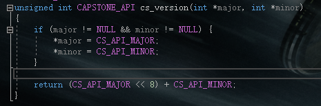

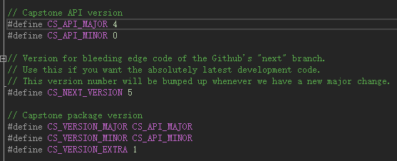


<details><summary> 示例1 </summary>

```c
#include <stdio.h>
#include <stdlib.h>

#include "platform.h"
#include "capstone.h"

static int test()
{
	return cs_version(NULL, NULL);	
}

int main()
{
	int version = test();
	printf("%X", version);
	return 0;
}
```

</details>

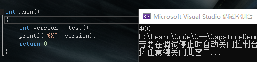


<details><summary> 示例2，强行修改版本 </summary>

```cpp
#include <stdio.h>
#include <stdlib.h>

#include "platform.h"
#include "capstone.h"

static int test()
{
	int ma[] = { 5 };
	int mi[] = { 6 };

	return cs_version(ma, mi);	
}

int main()
{
	int version = test();
	printf("%X", version);
	return 0;
}
```

</details>

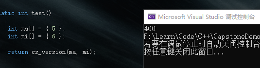

可见并不能改变

### cs_support

`bool CAPSTONE_API cs_support(int query);`

用来检查capstone库是否支持参数输入的架构或处于某编译选项

<details><summary> 源码实现 </summary>


```cpp
bool CAPSTONE_API cs_support(int query)
{
	if (query == CS_ARCH_ALL)
		return all_arch == ((1 << CS_ARCH_ARM) | (1 << CS_ARCH_ARM64) |
				(1 << CS_ARCH_MIPS) | (1 << CS_ARCH_X86) |
				(1 << CS_ARCH_PPC) | (1 << CS_ARCH_SPARC) |
				(1 << CS_ARCH_SYSZ) | (1 << CS_ARCH_XCORE) |
				(1 << CS_ARCH_M68K) | (1 << CS_ARCH_TMS320C64X) |
				(1 << CS_ARCH_M680X) | (1 << CS_ARCH_EVM));

	if ((unsigned int)query < CS_ARCH_MAX)
		return all_arch & (1 << query);

	if (query == CS_SUPPORT_DIET) {
#ifdef CAPSTONE_DIET
		return true;
#else
		return false;
#endif
	}

	if (query == CS_SUPPORT_X86_REDUCE) {
#if defined(CAPSTONE_HAS_X86) && defined(CAPSTONE_X86_REDUCE)
		return true;
#else
		return false;
#endif
	}

	// unsupported query
	return false;
}
```

</details>

示例1(CS_ARCH_ALL，检查是否支持所有架构)

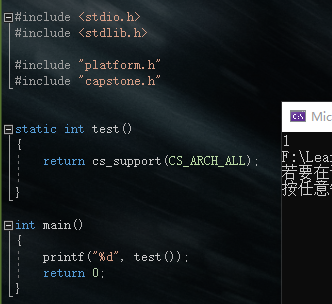

示例2(CS_ARCH_*，检查是否支持指定架构)

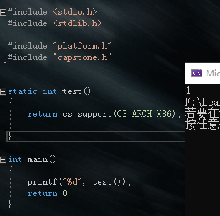

示例3(检查是否处于DIET编译模式)：

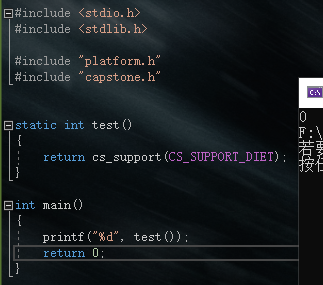

示例4(检查是否处于X86_REDUCE编译模式)

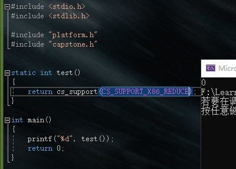


### cs_malloc_t

`void* (CAPSTONE_API *cs_malloc_t)(size_t size);`

cs的动态内存分配，用于

```cpp
struct cs_opt_mem {
	cs_malloc_t malloc;
	cs_calloc_t calloc;
	cs_realloc_t realloc;
	cs_free_t free;
	cs_vsnprintf_t vsnprintf;
} cs_opt_mem;
```

在用户模式下，cs_mem_malloc默认使用系统malloc

Windows driver模式下，`cs_malloc_t cs_mem_malloc = cs_winkernel_malloc;`

cs_winkernel_malloc定义于\capstone-4.0.1\windows\winkernel_mm.c,

<details><summary> 源码实现 </summary>

```cpp
void * CAPSTONE_API cs_winkernel_malloc(size_t size)
{
	// 长度不能分配为0
	NT_ASSERT(size);

	// FP; NonPagedPool用于支持 Windows 7 
#pragma prefast(suppress : 30030)		// 分配可执行的POOL_TYPE内存
	size_t number_of_bytes = 0;
	CS_WINKERNEL_MEMBLOCK *block = NULL;
	// 特定的值能造成溢出
	// 如果value中的和超出或低于类型容量，函数将返回NULL。
	if (!NT_SUCCESS(RtlSizeTAdd(size, sizeof(CS_WINKERNEL_MEMBLOCK), &number_of_bytes))) {
		return NULL;
	}
	block = (CS_WINKERNEL_MEMBLOCK *)ExAllocatePoolWithTag(
			NonPagedPool, number_of_bytes, CS_WINKERNEL_POOL_TAG);
	if (!block) {
		return NULL;
	}
	block->size = size;

	return block->data;
}
```

</details>

> OSX kernel模式下，`cs_malloc_t cs_mem_malloc = kern_os_malloc;`，这里暂且不探讨。


### cs_calloc_t

`void* (CAPSTONE_API *cs_calloc_t)(size_t nmemb, size_t size);`

cs申请内存并初始化

用于`struct cs_opt_mem`，定义于cs.c

用户模式： `cs_calloc_t cs_mem_calloc = calloc;`,使用系统calloc

Windows driver模式： `cs_calloc_t cs_mem_calloc = cs_winkernel_calloc;`

<details><summary> 源码实现 </summary>

```cpp
void * CAPSTONE_API cs_winkernel_calloc(size_t n, size_t size)
{
	size_t total = n * size;

	void *new_ptr = cs_winkernel_malloc(total);
	if (!new_ptr) {
		return NULL;
	}

	return RtlFillMemory(new_ptr, total, 0);
}
```

</details>

> OSX kernel模式： `cs_calloc_t cs_mem_calloc = cs_kern_os_calloc;` 直接调用kern_os_malloc


### cs_realloc_t

`void* (CAPSTONE_API *cs_realloc_t)(void *ptr, size_t size);`

cs重新分配内存

用于`struct cs_opt_mem`，定义于cs.c

用户模式： `cs_realloc_t cs_mem_realloc = realloc;`,调用系统realloc

Windows driver模式： `cs_realloc_t cs_mem_realloc = cs_winkernel_realloc;`

<details><summary> 源码实现 </summary>

```cpp
void * CAPSTONE_API cs_winkernel_realloc(void *ptr, size_t size)
{
	void *new_ptr = NULL;
	size_t current_size = 0;
	size_t smaller_size = 0;

	if (!ptr) {
		return cs_winkernel_malloc(size);
	}

	new_ptr = cs_winkernel_malloc(size);
	if (!new_ptr) {
		return NULL;
	}

	current_size = CONTAINING_RECORD(ptr, CS_WINKERNEL_MEMBLOCK, data)->size;
	smaller_size = (current_size < size) ? current_size : size;
	RtlCopyMemory(new_ptr, ptr, smaller_size);
	cs_winkernel_free(ptr);

	return new_ptr;
}
```

</details>

> OSX kernel模式： `cs_realloc_t cs_mem_realloc = kern_os_realloc;`


### cs_free_t

`typedef void (CAPSTONE_API *cs_free_t)(void *ptr);`

cs释放内存

用于`struct cs_opt_mem`，定义于cs.c

用户模式： `cs_free_t cs_mem_free = free;`,调用系统free

Windows driver模式： `cs_free_t cs_mem_free = cs_winkernel_free;`

<details><summary> 源码实现 </summary>

```cpp
void CAPSTONE_API cs_winkernel_free(void *ptr)
{
	if (ptr) {
		ExFreePoolWithTag(CONTAINING_RECORD(ptr, CS_WINKERNEL_MEMBLOCK, data), CS_WINKERNEL_POOL_TAG);
	}
}
```

</details>

> OSX kernel模式：  `cs_free_t cs_mem_free = kern_os_free;`


### cs_vsnprintf_t

`int (CAPSTONE_API *cs_vsnprintf_t)(char *str, size_t size, const char *format, va_list ap);`

按size大小输出到字符串str中

如果系统为wince，将使用_vsnprintf函数

vsnprintf ()和_vsnprintf()对于驱动程序都是可用的，但是它们有一些不同

在需要返回值和设置空终止符时应使用vsnprintf()

Windows driver模式： `cs_vsnprintf_t cs_vsnprintf = cs_winkernel_vsnprintf;`

<details><summary> 源码实现 </summary>

```cpp
int CAPSTONE_API cs_winkernel_vsnprintf(char *buffer, size_t count, const char *format, va_list argptr)
{
	int result = _vsnprintf(buffer, count, format, argptr);

	    // _vsnprintf()在字符串被截断时返回-1，在整个字符串被存储但“buffer”末尾没有“\0”时返回“count”。在这两种情况下，都需要手动添加空终止符。
	if (result == -1 || (size_t)result == count) {
		buffer[count - 1] = '\0';
	}

	if (result == -1) {
		// 在返回-1时，函数必须获取并返回一些本来要写入的字符。因此，通过重试使用temp buffer进行相同的转换，这个缓冲区就可能足够大来完成格式化，并且获得很多本应写入的字符。
		char* tmp = cs_winkernel_malloc(0x1000);
		if (!tmp) {
			return result;
		}

		result = _vsnprintf(tmp, 0x1000, format, argptr);
		NT_ASSERT(result != -1);
		cs_winkernel_free(tmp);
	}

	return result;
}
```

</details>

> OSX kernel模式： `cs_vsnprintf_t cs_vsnprintf = vsnprintf;`，使用默认vsnprintf


### cs_skipdata_cb_t

`size_t (CAPSTONE_API *cs_skipdata_cb_t)(const uint8_t *code, size_t code_size, size_t offset, void *user_data);`

SKIPDATA选项的用户自定义回调函数。

```
code:包含要分解的代码的输入缓冲区。和传递给cs_disasm()的缓冲区相同。
code_size:上面的code缓冲区的大小(以字节为单位)。
offset:上面提到的输入缓冲区code中当前检查字节的位置。
user_data:用户数据通过cs_opt_skipdata结构中的@user_data字段传递给cs_option()。
return:返回要跳过的字节数，或者0表示立即停止反汇编。
```

cs_skipdata_cb_t在`struct cs_opt_skipdata`中调用

<details><summary> 示例 </summary>

```cpp
#include <stdio.h>
#include <stdlib.h>

#include "platform.h"
#include "capstone.h"

struct platform {
	cs_arch arch;
	cs_mode mode;
	unsigned char* code;
	size_t size;
	const char* comment;
	cs_opt_type opt_type;
	cs_opt_value opt_value;
	cs_opt_type opt_skipdata;
	size_t skipdata;
};

static void print_string_hex(unsigned char* str, size_t len)  //输出机器码
{
	unsigned char* c;

	printf("Code: ");
	for (c = str; c < str + len; c++) {
		printf("0x%02x ", *c & 0xff);
	}
	printf("\n");
}

static void test()
{

#define X86_CODE32 "\x8d\x4c\x32\x08\x01\xd8\x81\xc6\x34\x12\x00\x00\x00\x91\x92"  //测试用机器码

#define RANDOM_CODE "\xed\x00\x00\x00\x00\x1a\x5a\x0f\x1f\xff\xc2\x09\x80\x00\x00\x00\x07\xf7\xeb\x2a\xff\xff\x7f\x57\xe3\x01\xff\xff\x7f\x57\xeb\x00\xf0\x00\x00\x24\xb2\x4f\x00\x78"

	cs_opt_skipdata skipdata = {
		// 把默认 "data" 描述符从 ".byte" 重命名为 "db"
		"db",
	};

	struct platform platforms[2] = {         //以默认描述符和自定义描述符两种方式建立一个数组
		{
			CS_ARCH_X86,
			CS_MODE_32,
			(unsigned char*)X86_CODE32,
			sizeof(X86_CODE32) - 1,
			"X86 32 (Intel syntax) - Skip data",
		},
		{
			CS_ARCH_X86,
			CS_MODE_32,
			(unsigned char*)X86_CODE32,
			sizeof(X86_CODE32) - 1,
			"X86 32 (Intel syntax) - Skip data with custom mnemonic",
			CS_OPT_INVALID,
			CS_OPT_OFF,
			CS_OPT_SKIPDATA_SETUP,
			(size_t)& skipdata,
		},

	};
	
	csh handle;   //建立capstone句柄
	uint64_t address = 0x1000;  //设置起始地址
	cs_insn* insn;  //具体信息结构体
	cs_err err;  //错误枚举
	int i;
	size_t count;  //成功反汇编行数

	for (i = 0; i < sizeof(platforms) / sizeof(platforms[0]); i++) {
		printf("****************\n");
		printf("Platform: %s\n", platforms[i].comment);
		err = cs_open(platforms[i].arch, platforms[i].mode, &handle);  //错误检查
		if (err) {
			printf("Failed on cs_open() with error returned: %u\n", err);
			abort();
		}

		if (platforms[i].opt_type)
			cs_option(handle, platforms[i].opt_type, platforms[i].opt_value);

		// 打开SKIPDATA 模式
		cs_option(handle, CS_OPT_SKIPDATA, CS_OPT_ON);
		cs_option(handle, platforms[i].opt_skipdata, platforms[i].skipdata);

		count = cs_disasm(handle, platforms[i].code, platforms[i].size, address, 0, &insn);
		if (count) {
			size_t j;

			print_string_hex(platforms[i].code, platforms[i].size);
			printf("Disasm:\n");

			for (j = 0; j < count; j++) {  //输出汇编
				printf("0x%" PRIx64 ":\t%s\t\t%s\n",
					insn[j].address, insn[j].mnemonic, insn[j].op_str);
			}

			// 最后一行代码后打印偏移
			printf("0x%" PRIx64 ":\n", insn[j - 1].address + insn[j - 1].size);

			// 释放cs_disasm()申请的内存
			cs_free(insn, count);
		}
		else {
			printf("****************\n");
			printf("Platform: %s\n", platforms[i].comment);
			print_string_hex(platforms[i].code, platforms[i].size);
			printf("ERROR: Failed to disasm given code!\n");
			abort();
		}

		printf("\n");

		cs_close(&handle);
	}
}

int main()
{
	test();

	return 0;
}
```

</details>

运行结果如下，默认的.byte数据类型被改为db描述符

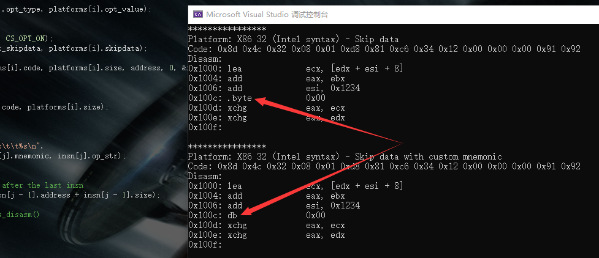


### cs_open

`cs_err CAPSTONE_API cs_open(cs_arch arch, cs_mode mode, csh *handle);`

初始化cs句柄

```
arch: 架构类型 (CS_ARCH_*)
mode: 硬件模式. CS_MODE_*在cs_mode数据类型中可查
handle: 指向句柄, 返回时更新
return: 创建成功返回CS_ERR_OK，否则返回cs_err枚举中对应的错误信息
```

<details><summary> 源码实现 </summary>

```cpp
cs_err CAPSTONE_API cs_open(cs_arch arch, cs_mode mode, csh *handle)
{
	cs_err err;
	struct cs_struct *ud;
	if (!cs_mem_malloc || !cs_mem_calloc || !cs_mem_realloc || !cs_mem_free || !cs_vsnprintf)
		// Error: 使用cs_open()前, 必须使用cs_option(CS_OPT_MEM)进行动态内存管理的初始化
		return CS_ERR_MEMSETUP;

	if (arch < CS_ARCH_MAX && cs_arch_init[arch]) {
		// 验证架构是否使用，方式：架构在枚举中且可初始化
		if (mode & cs_arch_disallowed_mode_mask[arch]) {
			*handle = 0;
			return CS_ERR_MODE;
		}

		ud = cs_mem_calloc(1, sizeof(*ud));
		if (!ud) {
			// 内存不足
			return CS_ERR_MEM;
		}

		ud->errnum = CS_ERR_OK;
		ud->arch = arch;
		ud->mode = mode;
		// 默认情况指令不打开detail模式
		ud->detail = CS_OPT_OFF;

		// 默认skipdata设置
		ud->skipdata_setup.mnemonic = SKIPDATA_MNEM;

		err = cs_arch_init[ud->arch](ud);
		if (err) {
			cs_mem_free(ud);
			*handle = 0;
			return err;
		}

		*handle = (uintptr_t)ud;

		return CS_ERR_OK;
	} else {
		*handle = 0;
		return CS_ERR_ARCH;
	}
}
```

其中，cs_struct结构体包含更多细节设定，如下

```cpp
struct cs_struct {
	cs_arch arch;
	cs_mode mode;
	Printer_t printer;	// 打印asm
	void *printer_info; // 打印信息
	Disasm_t disasm;	// 反编译
	void *getinsn_info; // 打印辅助信息
	GetName_t reg_name;
	GetName_t insn_name;
	GetName_t group_name;
	GetID_t insn_id;
	PostPrinter_t post_printer;
	cs_err errnum;
	ARM_ITStatus ITBlock;	// ARM特殊选项
	cs_opt_value detail, imm_unsigned;
	int syntax;	//ARM, Mips & PPC等架构的基本asm语法打印
	bool doing_mem;	// 在InstPrinter代码中处理内存操作数
	unsigned short *insn_cache;	//为mapping.c建立缓存索引
	GetRegisterName_t get_regname;
	bool skipdata;	// 如果反编译时要跳过数据，该项设置为True
	uint8_t skipdata_size;	//要跳过bytes的数量
	cs_opt_skipdata skipdata_setup;	// 自定义skipdata设置
	const uint8_t *regsize_map;	//映射register大小 (目前仅支持x86)
	GetRegisterAccess_t reg_access;
	struct insn_mnem *mnem_list;	// 自定义指令助记符的链接list
};
```

</details>

示例(创建一个x86_64类型的cs句柄)

`cs_open(CS_ARCH_X86, CS_MODE_64, &handle)`


### cs_close

`cs_err CAPSTONE_API cs_close(csh *handle);`

释放句柄

```
handle: 指向一个cs_open()打开的句柄
return: 释放成功返回CS_ERR_OK,否则返回cs_err枚举的错误信息
```

释放句柄实质为将句柄值设置为0

<details><summary> 源码实现 </summary>

```cpp
cs_err CAPSTONE_API cs_close(csh *handle)
{
	struct cs_struct *ud;
	struct insn_mnem *next, *tmp;

	if (*handle == 0)
		// 句柄不可用
		return CS_ERR_CSH;

	ud = (struct cs_struct *)(*handle);

	if (ud->printer_info)
		cs_mem_free(ud->printer_info);

	// 释放自定义助记符的链接list
	tmp = ud->mnem_list;
	while(tmp) {
		next = tmp->next;
		cs_mem_free(tmp);
		tmp = next;
	}

	cs_mem_free(ud->insn_cache);

	memset(ud, 0, sizeof(*ud));
	cs_mem_free(ud);

	// handle值设置为0，保证这个句柄在cs_close()释放后不可使用
	*handle = 0;

	return CS_ERR_OK;
}
```

</details>

示例

`cs_close(&handle);`


### cs_option

`cs_err CAPSTONE_API cs_option(csh handle, cs_opt_type type, size_t value);`

反编译引擎的运行时选项

```
handle: cs_open()打开的句柄
type: 设置选项的类型
value: 与type对应的选项值
return: 设置成功返回CS_ERR_OK,否则返回cs_err枚举的错误信息
```

注意: 在CS_OPT_MEM的情况下，handle可以是任何值，因此cs_option(handle, CS_OPT_MEM, value)必须在cs_open()之前被调用

<details><summary> 源码实现 </summary>

```cpp
cs_err CAPSTONE_API cs_option(csh ud, cs_opt_type type, size_t value)
{
	struct cs_struct *handle;
	cs_opt_mnem *opt;

	// 支持在所有API前支持 (even cs_open())
	if (type == CS_OPT_MEM) {
		cs_opt_mem *mem = (cs_opt_mem *)value;

		cs_mem_malloc = mem->malloc;
		cs_mem_calloc = mem->calloc;
		cs_mem_realloc = mem->realloc;
		cs_mem_free = mem->free;
		cs_vsnprintf = mem->vsnprintf;

		return CS_ERR_OK;
	}

	handle = (struct cs_struct *)(uintptr_t)ud;
	if (!handle)
		return CS_ERR_CSH;

	switch(type) {
		default:
			break;

		case CS_OPT_UNSIGNED:
			handle->imm_unsigned = (cs_opt_value)value;
			return CS_ERR_OK;

		case CS_OPT_DETAIL:
			handle->detail = (cs_opt_value)value;
			return CS_ERR_OK;

		case CS_OPT_SKIPDATA:
			handle->skipdata = (value == CS_OPT_ON);
			if (handle->skipdata) {
				if (handle->skipdata_size == 0) {
					handle->skipdata_size = skipdata_size(handle);
				}
			}
			return CS_ERR_OK;

		case CS_OPT_SKIPDATA_SETUP:
			if (value)
				handle->skipdata_setup = *((cs_opt_skipdata *)value);
			return CS_ERR_OK;

		case CS_OPT_MNEMONIC:
			opt = (cs_opt_mnem *)value;
			if (opt->id) {
				if (opt->mnemonic) {
					struct insn_mnem *tmp;

					// 添加新指令或替换现有指令
					// 查看当前insn释放在list中
					tmp = handle->mnem_list;
					while(tmp) {
						if (tmp->insn.id == opt->id) {
							// f找到指令，替换助记符
							(void)strncpy(tmp->insn.mnemonic, opt->mnemonic, sizeof(tmp->insn.mnemonic) - 1);
							tmp->insn.mnemonic[sizeof(tmp->insn.mnemonic) - 1] = '\0';
							break;
						}
						tmp = tmp->next;
					}

					// 2. 如果没有就添加这条指令
					if (!tmp) {
						tmp = cs_mem_malloc(sizeof(*tmp));
						tmp->insn.id = opt->id;
						(void)strncpy(tmp->insn.mnemonic, opt->mnemonic, sizeof(tmp->insn.mnemonic) - 1);
						tmp->insn.mnemonic[sizeof(tmp->insn.mnemonic) - 1] = '\0';
						// 新指令放在list最前面
						tmp->next = handle->mnem_list;
						handle->mnem_list = tmp;
					}
					return CS_ERR_OK;
				} else {
					struct insn_mnem *prev, *tmp;

					tmp = handle->mnem_list;
					prev = tmp;
					while(tmp) {
						if (tmp->insn.id == opt->id) {
							// 删除指令
							if (tmp == prev) {
								handle->mnem_list = tmp->next;
							} else {
								prev->next = tmp->next;
							}
							cs_mem_free(tmp);
							break;
						}
						prev = tmp;
						tmp = tmp->next;
					}
				}
			}
			return CS_ERR_OK;

		case CS_OPT_MODE:
			// 验证所请求的模式是否有效
			if (value & cs_arch_disallowed_mode_mask[handle->arch]) {
				return CS_ERR_OPTION;
			}
			break;
	}

	return cs_arch_option[handle->arch](handle, type, value);
}
```
</details>


<details><summary> 示例，更改反汇编后显示的语法 </summary>

```cpp
#include <iostream>
#include <stdio.h>

#include "capstone.h"
#include "platform.h"

using namespace std;

#define CODE "\x55\x48\x8b\x05\xb8\x13\x00\x00"

int main(void)
{
	csh handle;
	cs_insn* insn;
	size_t count;

	if (cs_open(CS_ARCH_X86, CS_MODE_64, &handle)) {
		printf("ERROR: Failed to initialize engine!\n");
		return -1;
	}
	cs_option(handle, CS_OPT_SYNTAX, CS_OPT_SYNTAX_ATT);  // 以AT&T语法显示
	count = cs_disasm(handle, (unsigned char*)CODE, sizeof(CODE) - 1, 0x1000, 0, &insn);
	if (count) {
		size_t j;

		for (j = 0; j < count; j++) {
			printf("0x%""Ix"":\t%s\t\t%s\n", insn[j].address, insn[j].mnemonic, insn[j].op_str);
		}

		cs_free(insn, count);
	}
	else
		printf("ERROR: Failed to disassemble given code!\n");

	cs_close(&handle);

	return 0;
}
```

</details>

输出

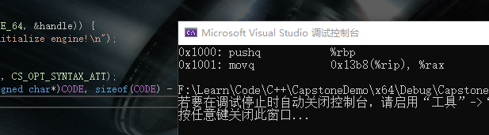


### cs_errno

`cs_err CAPSTONE_API cs_errno(csh handle);`

API出错时返回错误消息

```
handle: cs_open()打开的句柄
return: 无错误返回CS_ERR_OK,否则返回cs_err枚举的错误信息
```

判断到句柄不存在直接返回CS_ERR_CSH

<details><summary> 示例 </summary>

```cpp
#include <iostream>
#include <stdio.h>

#include "capstone.h"
#include "platform.h"

using namespace std;

#define CODE "\x55\x48\x8b\x05\xb8\x13\x00\x00"

int main(void)
{
	csh handle = 0;
	cs_insn* insn;
	size_t count;

	if (cs_open(CS_ARCH_X86, CS_MODE_64, &handle)) {
		printf("ERROR: Failed to initialize engine!\n");
		return -1;
	}

	cs_close(&handle);
	std::cout << cs_errno(handle);    //关闭句柄后检查将报错
	return 0;
}
```

</details>

输出，错误码4即CS_ERR_CSH

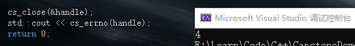


### cs_strerror

`const char * CAPSTONE_API cs_strerror(cs_err code);`

将上个API输出的错误码转换为详细错误信息

<details><summary> 源码实现 </summary>

```cpp
const char * CAPSTONE_API cs_strerror(cs_err code)
{
	switch(code) {
		default:
			return "Unknown error code";
		case CS_ERR_OK:
			return "OK (CS_ERR_OK)";
		case CS_ERR_MEM:
			return "Out of memory (CS_ERR_MEM)";
		case CS_ERR_ARCH:
			return "Invalid/unsupported architecture(CS_ERR_ARCH)";
		case CS_ERR_HANDLE:
			return "Invalid handle (CS_ERR_HANDLE)";
		case CS_ERR_CSH:
			return "Invalid csh (CS_ERR_CSH)";
		case CS_ERR_MODE:
			return "Invalid mode (CS_ERR_MODE)";
		case CS_ERR_OPTION:
			return "Invalid option (CS_ERR_OPTION)";
		case CS_ERR_DETAIL:
			return "Details are unavailable (CS_ERR_DETAIL)";
		case CS_ERR_MEMSETUP:
			return "Dynamic memory management uninitialized (CS_ERR_MEMSETUP)";
		case CS_ERR_VERSION:
			return "Different API version between core & binding (CS_ERR_VERSION)";
		case CS_ERR_DIET:
			return "Information irrelevant in diet engine (CS_ERR_DIET)";
		case CS_ERR_SKIPDATA:
			return "Information irrelevant for 'data' instruction in SKIPDATA mode (CS_ERR_SKIPDATA)";
		case CS_ERR_X86_ATT:
			return "AT&T syntax is unavailable (CS_ERR_X86_ATT)";
		case CS_ERR_X86_INTEL:
			return "INTEL syntax is unavailable (CS_ERR_X86_INTEL)";
		case CS_ERR_X86_MASM:
			return "MASM syntax is unavailable (CS_ERR_X86_MASM)";
	}
}
```
</details>


<details><summary> 示例，结合cs_errno使用 </summary>

```cpp
#include <iostream>
#include <stdio.h>

#include "capstone.h"
#include "platform.h"

using namespace std;

#define CODE "\x55\x48\x8b\x05\xb8\x13\x00\x00"

int main(void)
{
	csh handle = 0;
	cs_insn* insn;
	size_t count;

	if (cs_open(CS_ARCH_X86, CS_MODE_64, &handle)) {
		printf("ERROR: Failed to initialize engine!\n");
		return -1;
	}

	cs_close(&handle);
	std::cout << cs_strerror(cs_errno(handle));  //直接输出报错信息
	return 0;
}
```

</details>

输出

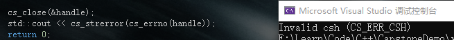


### cs_disasm

```cpp
size_t CAPSTONE_API cs_disasm(csh handle,
		const uint8_t *code, size_t code_size,
		uint64_t address,
		size_t count,
		cs_insn **insn);
```

给定缓冲区、大小、地址和编号，反编译机器码

API动态地分配内存来包含分解的指令，生成的指令将放在*insn中

注意： 必须释放分配的内存，以避免内存泄漏。对于需要动态分配稀缺内存的系统(如OS内核或固件)，API cs_disasm_iter()可能是比cs_disasm()更好的选择。原因是，使用cs_disasm()时，基于有限的可用内存，必须预先计算要分解多少条指令。

```
handle: cs_open()返回的句柄
code: 包含要反汇编的机器码的缓冲区。
code_size:上面代码缓冲区的大小。
address:给定原始代码缓冲区中的第一条指令的地址。
insn: 由这个API填写的指令数组。注意: insn将由这个函数分配，应该用cs_free () API释放
count: 需要分解的指令数量，或输入0分解所有指令
return:成功反汇编指令的数量，如果该函数未能反汇编给定的代码，则为0，失败时，调用cs_errno()获取错误代码。
```

<details><summary> 源码实现 </summary>

```cpp
size_t CAPSTONE_API cs_disasm(csh ud, const uint8_t *buffer, size_t size, uint64_t offset, size_t count, cs_insn **insn)
{
	struct cs_struct *handle;
	MCInst mci;
	uint16_t insn_size;
	size_t c = 0, i;
	unsigned int f = 0;	// 缓存中下一条指令的索引
	cs_insn *insn_cache;	// 缓存反汇编后的指令
	void *total = NULL;
	size_t total_size = 0;	//所有insn的输出缓冲区的总大小
	bool r;
	void *tmp;
	size_t skipdata_bytes;
	uint64_t offset_org; // 保存缓冲区的所有原始信息
	size_t size_org;
	const uint8_t *buffer_org;
	unsigned int cache_size = INSN_CACHE_SIZE;
	size_t next_offset;

	handle = (struct cs_struct *)(uintptr_t)ud;
	if (!handle) {
		// 修复方式:
		// handle->errnum = CS_ERR_HANDLE;
		return 0;
	}

	handle->errnum = CS_ERR_OK;

	// 重设ARM架构的IT block
	if (handle->arch == CS_ARCH_ARM)
		handle->ITBlock.size = 0;

#ifdef CAPSTONE_USE_SYS_DYN_MEM
	if (count > 0 && count <= INSN_CACHE_SIZE)
		cache_size = (unsigned int) count;
#endif

	// 保存SKIPDATA原始偏移量
	buffer_org = buffer;
	offset_org = offset;
	size_org = size;

	total_size = sizeof(cs_insn) * cache_size;
	total = cs_mem_malloc(total_size);
	if (total == NULL) {
		// 内存不足
		handle->errnum = CS_ERR_MEM;
		return 0;
	}

	insn_cache = total;

	while (size > 0) {
		MCInst_Init(&mci);
		mci.csh = handle;

		mci.address = offset;

		if (handle->detail) {
			//给detail指针分配内存
			insn_cache->detail = cs_mem_malloc(sizeof(cs_detail));
		} else {
			insn_cache->detail = NULL;
		}

		// 为non-detailed模式保存所有信息
		mci.flat_insn = insn_cache;
		mci.flat_insn->address = offset;
#ifdef CAPSTONE_DIET
		//mnemonic & op_str0填充
		mci.flat_insn->mnemonic[0] = '\0';
		mci.flat_insn->op_str[0] = '\0';
#endif

		r = handle->disasm(ud, buffer, size, &mci, &insn_size, offset, handle->getinsn_info);
		if (r) {
			SStream ss;
			SStream_Init(&ss);

			mci.flat_insn->size = insn_size;

			//将内部指令操作码映射到公共insn ID
			handle->insn_id(handle, insn_cache, mci.Opcode);

			handle->printer(&mci, &ss, handle->printer_info);
			fill_insn(handle, insn_cache, ss.buffer, &mci, handle->post_printer, buffer);

			// 调整opcode (X86)
			if (handle->arch == CS_ARCH_X86)
				insn_cache->id += mci.popcode_adjust;

			next_offset = insn_size;
		} else	{
			// 遇到中断指令

			// 为detail指针释放内存
			if (handle->detail) {
				cs_mem_free(insn_cache->detail);
			}

			if (!handle->skipdata || handle->skipdata_size > size)
				break;

			if (handle->skipdata_setup.callback) {
				skipdata_bytes = handle->skipdata_setup.callback(buffer_org, size_org,
						(size_t)(offset - offset_org), handle->skipdata_setup.user_data);
				if (skipdata_bytes > size)
					break;

				if (!skipdata_bytes)
					break;
			} else
				skipdata_bytes = handle->skipdata_size;

			insn_cache->id = 0;
			insn_cache->address = offset;
			insn_cache->size = (uint16_t)skipdata_bytes;
			memcpy(insn_cache->bytes, buffer, skipdata_bytes);
#ifdef CAPSTONE_DIET
			insn_cache->mnemonic[0] = '\0';
			insn_cache->op_str[0] = '\0';
#else
			strncpy(insn_cache->mnemonic, handle->skipdata_setup.mnemonic,
					sizeof(insn_cache->mnemonic) - 1);
			skipdata_opstr(insn_cache->op_str, buffer, skipdata_bytes);
#endif
			insn_cache->detail = NULL;

			next_offset = skipdata_bytes;
		}

		// 一条新指令进入缓存
		f++;

		// 反汇编了一条指令
		c++;
		if (count > 0 && c == count)
			break;

		if (f == cache_size) {
			cache_size = cache_size * 8 / 5; 
			total_size += (sizeof(cs_insn) * cache_size);
			tmp = cs_mem_realloc(total, total_size);
			if (tmp == NULL) {	//内存不足
				if (handle->detail) {
					insn_cache = (cs_insn *)total;
					for (i = 0; i < c; i++, insn_cache++)
						cs_mem_free(insn_cache->detail);
				}

				cs_mem_free(total);
				*insn = NULL;
				handle->errnum = CS_ERR_MEM;
				return 0;
			}

			total = tmp;
			//在最后一条指令之后继续填充缓存
			insn_cache = (cs_insn *)((char *)total + sizeof(cs_insn) * c);

			// 将f重置为0，从一开始就填入缓存
			f = 0;
		} else
			insn_cache++;

		buffer += next_offset;
		size -= next_offset;
		offset += next_offset;
	}

	if (!c) {
		//未反汇编任何指令
		cs_mem_free(total);
		total = NULL;
	} else if (f != cache_size) {
		// 没有完全使用最后一个缓存，缩小大小
		tmp = cs_mem_realloc(total, total_size - (cache_size - f) * sizeof(*insn_cache));
		if (tmp == NULL) {	// 内存不足
			// 释放所有detail指针
			if (handle->detail) {
				insn_cache = (cs_insn *)total;
				for (i = 0; i < c; i++, insn_cache++)
					cs_mem_free(insn_cache->detail);
			}

			cs_mem_free(total);
			*insn = NULL;

			handle->errnum = CS_ERR_MEM;
			return 0;
		}

		total = tmp;
	}

	*insn = total;

	return c;
}
```

</details>


<details><summary> 示例，x86_64 </summary>

```cpp
#include <iostream>
#include <stdio.h>

#include "capstone.h"
#include "platform.h"

using namespace std;

#define CODE "\x55\x48\x8b\x05\xb8\x13\x00\x00\xe9\xea\xbe\xad\xde\xff\x25\x23\x01\x00\x00\xe8\xdf\xbe\xad\xde\x74\xff"

int main(void)
{
	csh handle = 0;
	cs_insn* insn;
	size_t count;

	if (cs_open(CS_ARCH_X86, CS_MODE_64, &handle)) {
		printf("ERROR: Failed to initialize engine!\n");
		return -1;
	}
	
	count = cs_disasm(handle, (unsigned char*)CODE, sizeof(CODE) - 1, 0x1000, 0, &insn);   //所有指令，基址0x1000，放入insn
	if (count) {
		size_t j;

		for (j = 0; j < count; j++) {
			printf("0x%""Ix"":\t%s\t\t%s\n", insn[j].address, insn[j].mnemonic, insn[j].op_str);
		}

		cs_free(insn, count);
	}
	else
		printf("ERROR: Failed to disassemble given code!\n");

	cs_close(&handle);

	return 0;
}
```

</details>

输出

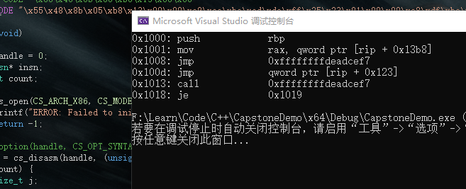


### cs_free

`void CAPSTONE_API cs_free(cs_insn *insn, size_t count);`

释放被 cs_malloc() 或 cs_disasm() 分配的内存(insn参数)

```
insn: 由cs_disasm()或cs_malloc()中的@insn参数返回的指针
count: 赋值由cs_disasm()返回的cs_insn结构的数量，或赋值为1表示由cs_malloc()分配给空闲内存的数量
```

<details><summary> 源码实现 </summary>

```cpp
void CAPSTONE_API cs_free(cs_insn *insn, size_t count)
{
	size_t i;

	// free 所有 detail 指针
	for (i = 0; i < count; i++)
		cs_mem_free(insn[i].detail);

	cs_mem_free(insn);
}
```

直接调用cs_mem_free,也就是默认的free

</details>


<details><summary> 示例(释放cs_disasm申请的内存) </summary>

```cpp
	count = cs_disasm(handle, (unsigned char*)CODE, sizeof(CODE) - 1, 0x1000, 0, &insn);           //计数由cs_disasm申请的内存
	if (count) {
		size_t j;

		for (j = 0; j < count; j++) {
			printf("0x%""Ix"":\t%s\t\t%s\n", insn[j].address, insn[j].mnemonic, insn[j].op_str);
		}

		cs_free(insn, count);   //循环依次释放每条insn的内存
	}
```

</details>


### cs_malloc

`cs_insn * CAPSTONE_API cs_malloc(csh handle);`

被用于在API cs_disasm_iter()中为一条指令分配内存

```
handle: cs_open()返回的句柄
```

<details><summary> 源码实现 </summary>

```cpp
cs_insn * CAPSTONE_API cs_malloc(csh ud)
{
	cs_insn *insn;
	struct cs_struct *handle = (struct cs_struct *)(uintptr_t)ud;

	insn = cs_mem_malloc(sizeof(cs_insn));
	if (!insn) {
		// insufficient memory
		handle->errnum = CS_ERR_MEM;
		return NULL;
	} else {
		if (handle->detail) {
			// allocate memory for @detail pointer
			insn->detail = cs_mem_malloc(sizeof(cs_detail));
			if (insn->detail == NULL) {	// insufficient memory
				cs_mem_free(insn);
				handle->errnum = CS_ERR_MEM;
				return NULL;
			}
		} else
			insn->detail = NULL;
	}
	
	return insn;
}
```

</details>

当这条指令所占的内存不再使用时，使用cs_free(insn, 1)释放，示例在下面cs_disasm_iter处


### cs_disasm_iter

```cpp
bool CAPSTONE_API cs_disasm_iter(csh handle,
	const uint8_t **code, size_t *size,
	uint64_t *address, cs_insn *insn);
```

给定buff、大小、地址和要解码的指令数，更快速的反汇编机器码，
这个API将生成的指令放入insn中的给定的缓存中。

注意1: 此API将更新code、size和address以指向输入缓冲区中的下一条指令。所以，虽然每次反汇编一条指令可以使用cs_disasm(count=1)来实现，但一些基准测试显示，在循环中使用cs_disasm_iter()可以方便地快速迭代所有指令，在随机输入时可以快30%。

注意2:可以使用cs_malloc()创建insn中的缓存。

注意3:对于动态分配内存可能产生内存不足的系统(比如OS内核或固件)，建议使用cs_disasm()这个API, 因为cs_disasm()是根据要分解的指令的数量来分配内存。

```
handle: cs_open()返回的句柄
code: 要反汇编的机器码所在的缓冲区
size: 机器码缓冲区的大小
address: 所给机器码缓冲区中第一个insn的地址
insn: 指向这个API要填充的指令的指针。
return:如果这个API成功反汇编了一条指令返回true，否则将返回false。
```

失败时，调用cs_errno()获取错误代码。

<details><summary> 代码实现，在cs_disasm基础上使用动态内存分配 </summary>

```cpp
bool CAPSTONE_API cs_disasm_iter(csh ud, const uint8_t **code, size_t *size,
		uint64_t *address, cs_insn *insn)
{
	struct cs_struct *handle;
	uint16_t insn_size;
	MCInst mci;
	bool r;

	handle = (struct cs_struct *)(uintptr_t)ud;
	if (!handle) {
		return false;
	}

	handle->errnum = CS_ERR_OK;

	MCInst_Init(&mci);
	mci.csh = handle;

	mci.address = *address;

	// 为无detail模式保存相关信息
	mci.flat_insn = insn;
	mci.flat_insn->address = *address;
#ifdef CAPSTONE_DIET
	mci.flat_insn->mnemonic[0] = '\0';
	mci.flat_insn->op_str[0] = '\0';
#endif

	r = handle->disasm(ud, *code, *size, &mci, &insn_size, *address, handle->getinsn_info);
	if (r) {
		SStream ss;
		SStream_Init(&ss);

		mci.flat_insn->size = insn_size;

		// 将内部指令操作码映射到公共insn ID
		handle->insn_id(handle, insn, mci.Opcode);

		handle->printer(&mci, &ss, handle->printer_info);

		fill_insn(handle, insn, ss.buffer, &mci, handle->post_printer, *code);

		// 调整伪操作码(X86)
		if (handle->arch == CS_ARCH_X86)
			insn->id += mci.popcode_adjust;

		*code += insn_size;
		*size -= insn_size;
		*address += insn_size;
	} else { 	// 遇到中断指令
		size_t skipdata_bytes;

		// 如果没有跳过数据的请求，或者剩余数据太小，则退出
		if (!handle->skipdata || handle->skipdata_size > *size)
			return false;

		if (handle->skipdata_setup.callback) {
			skipdata_bytes = handle->skipdata_setup.callback(*code, *size,
					0, handle->skipdata_setup.user_data);
			if (skipdata_bytes > *size)
				// 剩余数据太小
				return false;

			if (!skipdata_bytes)
				return false;
		} else
			skipdata_bytes = handle->skipdata_size;

		// 基于架构和模式跳过一些数据
		insn->id = 0;	// 此“数据”指令的ID无效
		insn->address = *address;
		insn->size = (uint16_t)skipdata_bytes;
#ifdef CAPSTONE_DIET
		insn->mnemonic[0] = '\0';
		insn->op_str[0] = '\0';
#else
		memcpy(insn->bytes, *code, skipdata_bytes);
		strncpy(insn->mnemonic, handle->skipdata_setup.mnemonic,
				sizeof(insn->mnemonic) - 1);
		skipdata_opstr(insn->op_str, *code, skipdata_bytes);
#endif

		*code += skipdata_bytes;
		*size -= skipdata_bytes;
		*address += skipdata_bytes;
	}

	return true;
}
```

</details>


<details><summary> 示例 </summary>

```cpp
#include <iostream>
#include <stdio.h>

#include "capstone.h"
#include "platform.h"

using namespace std;

struct platform {
	cs_arch arch;
	cs_mode mode;
	unsigned char* code;
	size_t size;
	const char* comment;
	cs_opt_type opt_type;
	cs_opt_value opt_value;
};

static void print_string_hex(unsigned char* str, size_t len)
{
	unsigned char* c;

	printf("Code: ");
	for (c = str; c < str + len; c++) {
		printf("0x%02x ", *c & 0xff);
	}
	printf("\n");
}

static void test()
{
#define X86_CODE16 "\x8d\x4c\x32\x08\x01\xd8\x81\xc6\x34\x12\x00\x00"
#define X86_CODE32 "\x8d\x4c\x32\x08\x01\xd8\x81\xc6\x34\x12\x00\x00"
#define X86_CODE64 "\x55\x48\x8b\x05\xb8\x13\x00\x00"

	struct platform platforms[4] = {     //架构及模式
		{
			CS_ARCH_X86,
			CS_MODE_16,
			(unsigned char*)X86_CODE16,
			sizeof(X86_CODE32) - 1,
			"X86 16bit (Intel syntax)"
		},
		{
			CS_ARCH_X86,
			CS_MODE_32,
			(unsigned char*)X86_CODE32,
			sizeof(X86_CODE32) - 1,
			"X86 32bit (ATT syntax)",
			CS_OPT_SYNTAX,
			CS_OPT_SYNTAX_ATT,
		},
		{
			CS_ARCH_X86,
			CS_MODE_32,
			(unsigned char*)X86_CODE32,
			sizeof(X86_CODE32) - 1,
			"X86 32 (Intel syntax)"
		},
		{
			CS_ARCH_X86,
			CS_MODE_64,
			(unsigned char*)X86_CODE64,
			sizeof(X86_CODE64) - 1,
			"X86 64 (Intel syntax)"
		},

	csh handle;
	uint64_t address;
	cs_insn* insn;
	cs_detail* detail;
	int i;
	cs_err err;
	const uint8_t* code;
	size_t size;

	for (i = 0; i < sizeof(platforms) / sizeof(platforms[0]); i++) {
		printf("****************\n");
		printf("Platform: %s\n", platforms[i].comment);
		err = cs_open(platforms[i].arch, platforms[i].mode, &handle);
		if (err) {
			printf("Failed on cs_open() with error returned: %u\n", err);
			abort();
		}

		if (platforms[i].opt_type)
			cs_option(handle, platforms[i].opt_type, platforms[i].opt_value);

		cs_option(handle, CS_OPT_DETAIL, CS_OPT_ON);

		// 为cs_disasm_iter()分配内存
		insn = cs_malloc(handle);

		print_string_hex(platforms[i].code, platforms[i].size);   //原机器码
		printf("Disasm:\n");

		address = 0x1000;
		code = platforms[i].code;
		size = platforms[i].size;
		while (cs_disasm_iter(handle, &code, &size, &address, insn)) {   //cs_disasm_iter反汇编
			int n;

			printf("0x%" PRIx64 ":\t%s\t\t%s // insn-ID: %u, insn-mnem: %s\n",
				insn->address, insn->mnemonic, insn->op_str,
				insn->id, cs_insn_name(handle, insn->id));

			// 打印此指令使用的隐式寄存器
			detail = insn->detail;

			if (detail->regs_read_count > 0) {
				printf("\tImplicit registers read: ");
				for (n = 0; n < detail->regs_read_count; n++) {
					printf("%s ", cs_reg_name(handle, detail->regs_read[n]));
				}
				printf("\n");
			}

			// 打印此指令修改的隐式寄存器
			if (detail->regs_write_count > 0) {
				printf("\tImplicit registers modified: ");
				for (n = 0; n < detail->regs_write_count; n++) {
					printf("%s ", cs_reg_name(handle, detail->regs_write[n]));
				}
				printf("\n");
			}

			// 打印此指令所属指令集
			if (detail->groups_count > 0) {
				printf("\tThis instruction belongs to groups: ");
				for (n = 0; n < detail->groups_count; n++) {
					printf("%s ", cs_group_name(handle, detail->groups[n]));
				}
				printf("\n");
			}
		}

		printf("\n");

		// 释放cs_malloc()分配的内存
		cs_free(insn, 1);

		cs_close(&handle);
	}
}

int main()
{
	test();

	return 0;
}
```

</details>

输出

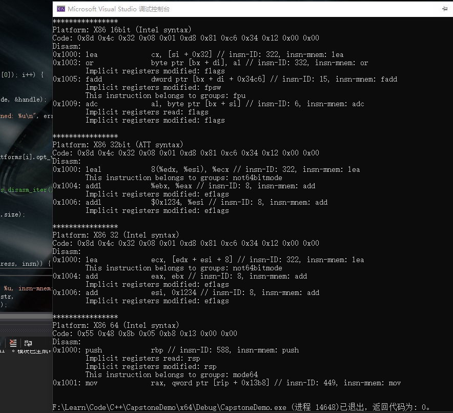


### cs_reg_name

`const char * CAPSTONE_API cs_reg_name(csh handle, unsigned int reg_id);`

获取寄存器的名字(string类型)
寄存器id可在相关架构的头文件(建立项目时复制到项目文件夹的那些头文件)内找到

注意： 当处于diet模式时此API不可用，因为引擎不会存储寄存器名

```
handle: cs_open()返回的句柄
reg_id: 寄存器id
return: 寄存器的字符名, 如果reg_id不可用返回NULL
```

<details><summary> 源码实现 </summary>

```cpp
const char * CAPSTONE_API cs_reg_name(csh ud, unsigned int reg)
{
	struct cs_struct *handle = (struct cs_struct *)(uintptr_t)ud;

	if (!handle || handle->reg_name == NULL) {
		return NULL;
	}

	return handle->reg_name(ud, reg);
}
```

</details>


<details><summary> 示例(打印RAX) </summary>

```cpp
#include <iostream>
#include <stdio.h>

#include "capstone.h"
#include "platform.h"

using namespace std;

int main(void)
{
	csh handle = 0;
	cs_insn* insn;
	size_t count;

	if (cs_open(CS_ARCH_X86, CS_MODE_64, &handle)) {
		printf("ERROR: Failed to initialize engine!\n");
		return -1;
	}

	printf("%s", cs_reg_name(handle, X86_REG_RAX));
	cs_close(&handle);

	return 0;
}
```

</details>

输出

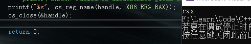


### cs_insn_name

`const char * CAPSTONE_API cs_insn_name(csh handle, unsigned int insn_id);`

获取指令的名字(string类型)

指令id可在相关架构的头文件(建立项目时复制到项目文件夹的那些头文件)内找到

注意： 当处于diet模式时此API不可用，因为引擎不会存储寄存器名

```
handle: cs_open()返回的句柄
insn_id: 指令id
return: 指令的字符名, 如果insn_id不可用返回NULL
```

<details><summary> 源码实现 </summary>

```cpp
const char * CAPSTONE_API cs_insn_name(csh ud, unsigned int insn)
{
	struct cs_struct *handle = (struct cs_struct *)(uintptr_t)ud;

	if (!handle || handle->insn_name == NULL) {
		return NULL;
	}
	
	return handle->insn_name(ud, insn);
}
```

</details>


<details><summary> 示例 </summary>

```cpp
#include <iostream>
#include <stdio.h>

#include "capstone.h"
#include "platform.h"

using namespace std;

struct platform {
	cs_arch arch;
	cs_mode mode;
	unsigned char* code;
	size_t size;
	const char* comment;
	cs_opt_type opt_type;
	cs_opt_value opt_value;
};

static void print_string_hex(unsigned char* str, size_t len)
{
	unsigned char* c;

	printf("Code: ");
	for (c = str; c < str + len; c++) {
		printf("0x%02x ", *c & 0xff);
	}
	printf("\n");
}

static void test()
{

#define X86_CODE64 "\x55\x48\x8b\x05\xb8\x13\x00\x00\xe9\xea\xbe\xad\xde\xff\x25\x23\x01\x00\x00\xe8\xdf\xbe\xad\xde\x74\xff"

	struct platform platforms[] = {
		{
			CS_ARCH_X86,
			CS_MODE_64,
			(unsigned char*)X86_CODE64,
			sizeof(X86_CODE64) - 1,
			"X86 64 (Intel syntax)"
		},
	};

	csh handle;
	uint64_t address;
	cs_insn* insn;
	cs_detail* detail;
	int i;
	cs_err err;
	const uint8_t* code;
	size_t size;

	for (i = 0; i < sizeof(platforms) / sizeof(platforms[0]); i++) {
		printf("****************\n");
		printf("Platform: %s\n", platforms[i].comment);
		err = cs_open(platforms[i].arch, platforms[i].mode, &handle);
		if (err) {
			printf("Failed on cs_open() with error returned: %u\n", err);
			abort();
		}

		if (platforms[i].opt_type)
			cs_option(handle, platforms[i].opt_type, platforms[i].opt_value);

		cs_option(handle, CS_OPT_DETAIL, CS_OPT_ON);

		insn = cs_malloc(handle);

		print_string_hex(platforms[i].code, platforms[i].size);
		printf("Disasm:\n");

		address = 0x1000;
		code = platforms[i].code;
		size = platforms[i].size;
		while (cs_disasm_iter(handle, &code, &size, &address, insn)) {
			int n;

			printf("0x%" PRIx64 ":\t%s\t\t%s",
				insn->address, insn->mnemonic, insn->op_str);
			printf("            instruction:  %s", cs_insn_name(handle, insn->id));   //输出该行的操作指令
			cout << endl;

		printf("\n");
		cs_free(insn, 1);
		cs_close(&handle);
	}
}

int main()
{
	test();

	return 0;
}
```

</details>

输出

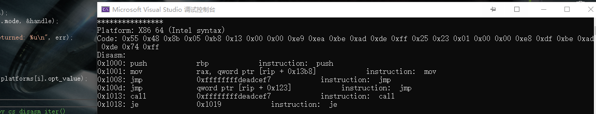


### cs_group_name

`const char * CAPSTONE_API cs_group_name(csh handle, unsigned int group_id);`

输出指令类型名字

指令id可在相关架构的头文件(建立项目时复制到项目文件夹的那些头文件)内找到

注意： 当处于diet模式时此API不可用，因为引擎不会存储寄存器名

```
handle: cs_open()返回的句柄
insn_id: 指令类型id
return: 指令类型的字符名, 如果insn_id不可用返回NULL
```

示例都与上面类似，略。


### cs_insn_group

`bool CAPSTONE_API cs_insn_group(csh handle, const cs_insn *insn, unsigned int group_id);`

检查反汇编后的指令是否属于某个特定指令类型

注意：只有当detail选项为ON时这个API可用 (默认OFF).

在“diet”模式下，此API没有用，因为引擎不更新insn->groups数组

```
handle: cs_open()返回的句柄
insn: 从cs_disasm()或cs_disasm_iter()接收的反汇编指令结构
group_id: 要检查此指令是否属于的指令类型。
return: 如果该指令确实属于给定的指令类型，则为true，否则为false。
```

<details><summary> 源码实现 </summary>

```cpp
bool CAPSTONE_API cs_insn_group(csh ud, const cs_insn *insn, unsigned int group_id)
{
	struct cs_struct *handle;
	if (!ud)
		return false;

	handle = (struct cs_struct *)(uintptr_t)ud;
	
	if (!handle->detail) {
		handle->errnum = CS_ERR_DETAIL;
		return false;
	}
	
	if (!insn->id) {
		handle->errnum = CS_ERR_SKIPDATA;
		return false;
	}
	
	if (!insn->detail) {
		handle->errnum = CS_ERR_DETAIL;
		return false;
	}
	
	return arr_exist8(insn->detail->groups, insn->detail->groups_count, group_id);
}
```

</details>


<details><summary> 示例(判断是否属于跳转指令) </summary>

```cpp
#include <iostream>
#include <stdio.h>

#include "capstone.h"
#include "platform.h"

using namespace std;

struct platform {
	cs_arch arch;
	cs_mode mode;
	unsigned char* code;
	size_t size;
	const char* comment;
	cs_opt_type opt_type;
	cs_opt_value opt_value;
};

static void print_string_hex(unsigned char* str, size_t len)
{
	unsigned char* c;

	printf("Code: ");
	for (c = str; c < str + len; c++) {
		printf("0x%02x ", *c & 0xff);
	}
	printf("\n");
}

static void test()
{

#define X86_CODE64 "\x55\x48\x8b\x05\xb8\x13\x00\x00\xe9\xea\xbe\xad\xde\xff\x25\x23\x01\x00\x00\xe8\xdf\xbe\xad\xde\x74\xff"

	struct platform platforms[] = {
		{
			CS_ARCH_X86,
			CS_MODE_64,
			(unsigned char*)X86_CODE64,
			sizeof(X86_CODE64) - 1,
			"X86 64 (Intel syntax)"
		},
	};

	csh handle;
	uint64_t address;
	cs_insn* insn;
	cs_detail* detail;
	int i;
	cs_err err;
	const uint8_t* code;
	size_t size;

	for (i = 0; i < sizeof(platforms) / sizeof(platforms[0]); i++) {
		printf("****************\n");
		printf("Platform: %s\n", platforms[i].comment);
		err = cs_open(platforms[i].arch, platforms[i].mode, &handle);
		if (err) {
			printf("Failed on cs_open() with error returned: %u\n", err);
			abort();
		}

		if (platforms[i].opt_type)
			cs_option(handle, platforms[i].opt_type, platforms[i].opt_value);

		cs_option(handle, CS_OPT_DETAIL, CS_OPT_ON);

		insn = cs_malloc(handle);

		print_string_hex(platforms[i].code, platforms[i].size);
		printf("Disasm:\n");

		address = 0x1000;
		code = platforms[i].code;
		size = platforms[i].size;
		while (cs_disasm_iter(handle, &code, &size, &address, insn)) {
			int n;

			printf("0x%" PRIx64 ":\t%s\t\t%s          ",
				insn->address, insn->mnemonic, insn->op_str);
			cout << "is JUMP:   " <<cs_insn_group(handle, insn, CS_GRP_JUMP) << endl;   //判断是否为跳转指令
			cout << endl;

		printf("\n");
		cs_free(insn, 1);
		cs_close(&handle);
	}
}

int main()
{
	test();

	return 0;
}
```

</details>

输出

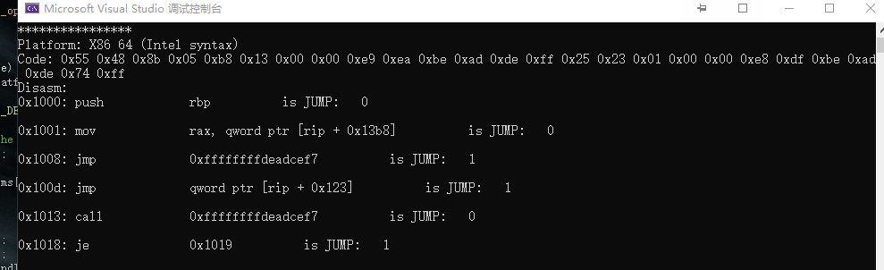


### cs_reg_read

`bool CAPSTONE_API cs_reg_read(csh handle, const cs_insn *insn, unsigned int reg_id);`

检查反汇编指令是否隐式使用特定寄存器。

注意:此API仅在启用detail选项时有效(默认为关闭)

在“diet”模式下，此API没有用，因为引擎不更新insn->regs_read数组

```
insn: 从cs_disasm()或cs_disasm_iter()接收的反汇编指令结构
reg_id: 标注想要检查的这个指令是否使用了它。
return: 如果该指令确实隐式使用了给定寄存器，则为true，否则为false。
```

<details><summary> 源码实现 </summary>

```cpp
bool CAPSTONE_API cs_reg_read(csh ud, const cs_insn *insn, unsigned int reg_id)
{
	struct cs_struct *handle;
	if (!ud)
		return false;

	handle = (struct cs_struct *)(uintptr_t)ud;

	if (!handle->detail) {
		handle->errnum = CS_ERR_DETAIL;
		return false;
	}

	if (!insn->id) {
		handle->errnum = CS_ERR_SKIPDATA;
		return false;
	}

	if (!insn->detail) {
		handle->errnum = CS_ERR_DETAIL;
		return false;
	}

	return arr_exist(insn->detail->regs_read, insn->detail->regs_read_count, reg_id);
}
```
</details>

示例同API cs_disasm_iter


### cs_reg_write

`bool CAPSTONE_API cs_reg_write(csh handle, const cs_insn *insn, unsigned int reg_id);`

检查反汇编指令是否隐式修改了特定寄存器。

注意:此API仅在启用detail选项时有效(默认为关闭)

在“diet”模式下，此API没有用，因为引擎不更新insn->regs_read数组

```
insn: 从cs_disasm()或cs_disasm_iter()接收的反汇编指令结构
reg_id: 标注想要检查的这个指令是否修改了它。
return: 如果该指令确实隐式修改了给定寄存器，则为true，否则为false。
```

<details><summary> 源码实现 </summary>

```cpp
bool CAPSTONE_API cs_reg_write(csh ud, const cs_insn *insn, unsigned int reg_id)
{
	struct cs_struct *handle;
	if (!ud)
		return false;

	handle = (struct cs_struct *)(uintptr_t)ud;
	
	if (!handle->detail) {
		handle->errnum = CS_ERR_DETAIL;
		return false;
	}
	
	if (!insn->id) {
		handle->errnum = CS_ERR_SKIPDATA;
		return false;
	}
	
	if (!insn->detail) {
		handle->errnum = CS_ERR_DETAIL;
		return false;
	}
	
	return arr_exist(insn->detail->regs_write, insn->detail->regs_write_count, reg_id);
}
```
</details>

示例同API cs_disasm_iter


### cs_op_count

`int CAPSTONE_API cs_op_count(csh handle, const cs_insn *insn, unsigned int op_type);`

计算给定类型的操作数的数量

注意：只有当detail选项为ON时这个API可用 (默认OFF).

```
handle: cs_open()返回的句柄
insn: 从cs_disasm()或cs_disasm_iter()接收的反汇编指令结构
op_type: 要找到的操作数类型。
return: 指令insn中给定类型op_type的操作数的数量，返回-1表示查找失败。
```

<details><summary> 源码实现 </summary>

```cpp
int CAPSTONE_API cs_op_count(csh ud, const cs_insn *insn, unsigned int op_type)
{
	struct cs_struct *handle;
	unsigned int count = 0, i;
	if (!ud)
		return -1;

	handle = (struct cs_struct *)(uintptr_t)ud;

	if (!handle->detail) {
		handle->errnum = CS_ERR_DETAIL;
		return -1;
	}

	if (!insn->id) {
		handle->errnum = CS_ERR_SKIPDATA;
		return -1;
	}

	if (!insn->detail) {
		handle->errnum = CS_ERR_DETAIL;
		return -1;
	}

	handle->errnum = CS_ERR_OK;

	switch (handle->arch) {
		default:
			handle->errnum = CS_ERR_HANDLE;
			return -1;
		case CS_ARCH_ARM:
			for (i = 0; i < insn->detail->arm.op_count; i++)
				if (insn->detail->arm.operands[i].type == (arm_op_type)op_type)
					count++;
			break;
		case CS_ARCH_ARM64:
			for (i = 0; i < insn->detail->arm64.op_count; i++)
				if (insn->detail->arm64.operands[i].type == (arm64_op_type)op_type)
					count++;
			break;
		case CS_ARCH_X86:
			for (i = 0; i < insn->detail->x86.op_count; i++)
				if (insn->detail->x86.operands[i].type == (x86_op_type)op_type)
					count++;
			break;
		case CS_ARCH_MIPS:
			for (i = 0; i < insn->detail->mips.op_count; i++)
				if (insn->detail->mips.operands[i].type == (mips_op_type)op_type)
					count++;
			break;
		case CS_ARCH_PPC:
			for (i = 0; i < insn->detail->ppc.op_count; i++)
				if (insn->detail->ppc.operands[i].type == (ppc_op_type)op_type)
					count++;
			break;
		case CS_ARCH_SPARC:
			for (i = 0; i < insn->detail->sparc.op_count; i++)
				if (insn->detail->sparc.operands[i].type == (sparc_op_type)op_type)
					count++;
			break;
		case CS_ARCH_SYSZ:
			for (i = 0; i < insn->detail->sysz.op_count; i++)
				if (insn->detail->sysz.operands[i].type == (sysz_op_type)op_type)
					count++;
			break;
		case CS_ARCH_XCORE:
			for (i = 0; i < insn->detail->xcore.op_count; i++)
				if (insn->detail->xcore.operands[i].type == (xcore_op_type)op_type)
					count++;
			break;
		case CS_ARCH_M68K:
			for (i = 0; i < insn->detail->m68k.op_count; i++)
				if (insn->detail->m68k.operands[i].type == (m68k_op_type)op_type)
					count++;
			break;
		case CS_ARCH_TMS320C64X:
			for (i = 0; i < insn->detail->tms320c64x.op_count; i++)
				if (insn->detail->tms320c64x.operands[i].type == (tms320c64x_op_type)op_type)
					count++;
			break;
		case CS_ARCH_M680X:
			for (i = 0; i < insn->detail->m680x.op_count; i++)
				if (insn->detail->m680x.operands[i].type == (m680x_op_type)op_type)
					count++;
			break;
		case CS_ARCH_EVM:
#if 0
			for (i = 0; i < insn->detail->evm.op_count; i++)
				if (insn->detail->evm.operands[i].type == (evm_op_type)op_type)
					count++;
#endif
			break;
	}

	return count;
}
```

</details>


<details><summary> x86指令操作码类型示例(判断寄存操作码) </summary>

```cpp
typedef enum x86_op_type {
	X86_OP_INVALID = 0, ///< = CS_OP_INVALID (未初始化).
	X86_OP_REG, ///< = CS_OP_REG (寄存操作码).
	X86_OP_IMM, ///< = CS_OP_IMM (立即操作码).
	X86_OP_MEM, ///< = CS_OP_MEM (内存操作码).
} x86_op_type;
```

```cpp
#include <iostream>
#include <stdio.h>

#include "capstone.h"
#include "platform.h"

using namespace std;

struct platform {
	cs_arch arch;
	cs_mode mode;
	unsigned char* code;
	size_t size;
	const char* comment;
	cs_opt_type opt_type;
	cs_opt_value opt_value;
};

static void print_string_hex(unsigned char* str, size_t len)
{
	unsigned char* c;

	printf("Code: ");
	for (c = str; c < str + len; c++) {
		printf("0x%02x ", *c & 0xff);
	}
	printf("\n");
}

static void test()
{

#define X86_CODE64 "\x55\x48\x8b\x05\xb8\x13\x00\x00\xe9\xea\xbe\xad\xde\xff\x25\x23\x01\x00\x00\xe8\xdf\xbe\xad\xde\x74\xff"

	struct platform platforms[] = {
		{
			CS_ARCH_X86,
			CS_MODE_64,
			(unsigned char*)X86_CODE64,
			sizeof(X86_CODE64) - 1,
			"X86 64 (Intel syntax)"
		},
	};

	csh handle;
	uint64_t address;
	cs_insn* insn;
	cs_detail* detail;
	int i;
	cs_err err;
	const uint8_t* code;
	size_t size;

	for (i = 0; i < sizeof(platforms) / sizeof(platforms[0]); i++) {
		printf("****************\n");
		printf("Platform: %s\n", platforms[i].comment);
		err = cs_open(platforms[i].arch, platforms[i].mode, &handle);
		if (err) {
			printf("Failed on cs_open() with error returned: %u\n", err);
			abort();
		}

		if (platforms[i].opt_type)
			cs_option(handle, platforms[i].opt_type, platforms[i].opt_value);

		cs_option(handle, CS_OPT_DETAIL, CS_OPT_ON);

		insn = cs_malloc(handle);

		print_string_hex(platforms[i].code, platforms[i].size);
		printf("Disasm:\n");

		address = 0x1000;
		code = platforms[i].code;
		size = platforms[i].size;
		while (cs_disasm_iter(handle, &code, &size, &address, insn)) {
			int n;

			printf("0x%" PRIx64 ":\t%s\t\t%s          ",
				insn->address, insn->mnemonic, insn->op_str);
			cout << "is REG:   " << cs_op_count(handle, insn, X86_OP_REG) << endl;   //判断是否为寄存操作码
			cout << endl;

		printf("\n");
		cs_free(insn, 1);
		cs_close(&handle);
	}
}

int main()
{
	test();

	return 0;
}
```

</details>

输出

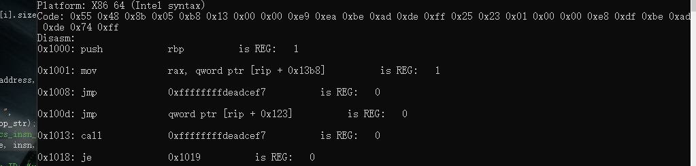


### cs_op_index

`int CAPSTONE_API cs_op_index(csh handle, const cs_insn *insn, unsigned int op_type, unsigned int position);`

检索给定类型的操作数在`<arch>.operands[]`数组中的位置, 使用返回的位置访问操作数

注意：只有当detail选项为ON时这个API可用 (默认OFF).

```
handle: cs_open()返回的句柄
insn: 从cs_disasm()或cs_disasm_iter()接收的反汇编指令结构
op_type: 要找到的操作数类型。
position: 要查找的操作数的位置。范围一定在`[1, cs_op_count(handle, insn, op_type)]`内
return: 指令insn的`<arch>.operands[]`数组中给定类型op_type的操作数的索引，失败时返回-1。
```

<details><summary> 源码实现 </summary>

```cpp
int CAPSTONE_API cs_op_index(csh ud, const cs_insn *insn, unsigned int op_type,
		unsigned int post)
{
	struct cs_struct *handle;
	unsigned int count = 0, i;
	if (!ud)
		return -1;

	handle = (struct cs_struct *)(uintptr_t)ud;

	if (!handle->detail) {
		handle->errnum = CS_ERR_DETAIL;
		return -1;
	}

	if (!insn->id) {
		handle->errnum = CS_ERR_SKIPDATA;
		return -1;
	}

	if (!insn->detail) {
		handle->errnum = CS_ERR_DETAIL;
		return -1;
	}

	handle->errnum = CS_ERR_OK;

	switch (handle->arch) {
		default:
			handle->errnum = CS_ERR_HANDLE;
			return -1;
		case CS_ARCH_ARM:
			for (i = 0; i < insn->detail->arm.op_count; i++) {
				if (insn->detail->arm.operands[i].type == (arm_op_type)op_type)
					count++;
				if (count == post)
					return i;
			}
			break;
		case CS_ARCH_ARM64:
			for (i = 0; i < insn->detail->arm64.op_count; i++) {
				if (insn->detail->arm64.operands[i].type == (arm64_op_type)op_type)
					count++;
				if (count == post)
					return i;
			}
			break;
		case CS_ARCH_X86:
			for (i = 0; i < insn->detail->x86.op_count; i++) {
				if (insn->detail->x86.operands[i].type == (x86_op_type)op_type)
					count++;
				if (count == post)
					return i;
			}
			break;
		case CS_ARCH_MIPS:
			for (i = 0; i < insn->detail->mips.op_count; i++) {
				if (insn->detail->mips.operands[i].type == (mips_op_type)op_type)
					count++;
				if (count == post)
					return i;
			}
			break;
		case CS_ARCH_PPC:
			for (i = 0; i < insn->detail->ppc.op_count; i++) {
				if (insn->detail->ppc.operands[i].type == (ppc_op_type)op_type)
					count++;
				if (count == post)
					return i;
			}
			break;
		case CS_ARCH_SPARC:
			for (i = 0; i < insn->detail->sparc.op_count; i++) {
				if (insn->detail->sparc.operands[i].type == (sparc_op_type)op_type)
					count++;
				if (count == post)
					return i;
			}
			break;
		case CS_ARCH_SYSZ:
			for (i = 0; i < insn->detail->sysz.op_count; i++) {
				if (insn->detail->sysz.operands[i].type == (sysz_op_type)op_type)
					count++;
				if (count == post)
					return i;
			}
			break;
		case CS_ARCH_XCORE:
			for (i = 0; i < insn->detail->xcore.op_count; i++) {
				if (insn->detail->xcore.operands[i].type == (xcore_op_type)op_type)
					count++;
				if (count == post)
					return i;
			}
			break;
		case CS_ARCH_M68K:
			for (i = 0; i < insn->detail->m68k.op_count; i++) {
				if (insn->detail->m68k.operands[i].type == (m68k_op_type)op_type)
					count++;
				if (count == post)
					return i;
			}
			break;
		case CS_ARCH_TMS320C64X:
			for (i = 0; i < insn->detail->tms320c64x.op_count; i++) {
				if (insn->detail->tms320c64x.operands[i].type == (tms320c64x_op_type)op_type)
					count++;
				if (count == post)
					return i;
			}
			break;
		case CS_ARCH_M680X:
			for (i = 0; i < insn->detail->m680x.op_count; i++) {
				if (insn->detail->m680x.operands[i].type == (m680x_op_type)op_type)
					count++;
				if (count == post)
					return i;
			}
			break;
	}

	return -1;
}
```
</details>


<details><summary> 示例 </summary>

```cpp
#include <iostream>
#include <stdio.h>

#include "capstone.h"
#include "platform.h"

using namespace std;

struct platform {
	cs_arch arch;
	cs_mode mode;
	unsigned char* code;
	size_t size;
	const char* comment;
	cs_opt_type opt_type;
	cs_opt_value opt_value;
};

static void print_string_hex(unsigned char* str, size_t len)
{
	unsigned char* c;

	printf("Code: ");
	for (c = str; c < str + len; c++) {
		printf("0x%02x ", *c & 0xff);
	}
	printf("\n");
}

static void test()
{
#define X86_CODE64 "\x55\x48\x8b\x05\xb8\x13\x00\x00\xe9\xea\xbe\xad\xde\xff\x25\x23\x01\x00\x00\xe8\xdf\xbe\xad\xde\x74\xff"
	struct platform platforms[] = {
		{
			CS_ARCH_X86,
			CS_MODE_64,
			(unsigned char*)X86_CODE64,
			sizeof(X86_CODE64) - 1,
			"X86 64 (Intel syntax)"
		},
	};

	csh handle;
	uint64_t address;
	cs_insn* insn;
	cs_detail* detail;
	int i;
	cs_err err;
	const uint8_t* code;
	size_t size;

	cs_x86* x86;
	
	int count;

	for (i = 0; i < sizeof(platforms) / sizeof(platforms[0]); i++) {
		printf("****************\n");
		printf("Platform: %s\n", platforms[i].comment);
		err = cs_open(platforms[i].arch, platforms[i].mode, &handle);
		if (err) {
			printf("Failed on cs_open() with error returned: %u\n", err);
			abort();
		}

		if (platforms[i].opt_type)
			cs_option(handle, platforms[i].opt_type, platforms[i].opt_value);

		cs_option(handle, CS_OPT_DETAIL, CS_OPT_ON);

		insn = cs_malloc(handle);
		x86 = &(insn->detail->x86);
		print_string_hex(platforms[i].code, platforms[i].size);
		printf("Disasm:\n");

		address = 0x1000;
		code = platforms[i].code;
		size = platforms[i].size;
		while (cs_disasm_iter(handle, &code, &size, &address, insn)) {
			int n;

			printf("0x%" PRIx64 ":\t%s\t\t%s          ",
				insn->address, insn->mnemonic, insn->op_str);
			cout << endl;

			count = cs_op_count(handle, insn, X86_OP_IMM);  //查找立即数
			if (count) {
				printf("\timm_count: %u\n", count);
				for (i = 1; i < count + 1; i++) {
					int index = cs_op_index(handle, insn, X86_OP_IMM, i);
					printf("\timms[%u]: 0x%" PRIx64 "\n", i, x86->operands[index].imm);
					if (x86->encoding.imm_offset != 0) {
						printf("\timm_offset: 0x%x\n", x86->encoding.imm_offset);
					}
					if (x86->encoding.imm_size != 0) {
						printf("\timm_size: 0x%x\n", x86->encoding.imm_size);
					}
				}
			}
		}

		printf("\n");
		cs_free(insn, 1);
		cs_close(&handle);
	}
}

int main()
{
	test();
	return 0;
}
```

</details>

输出
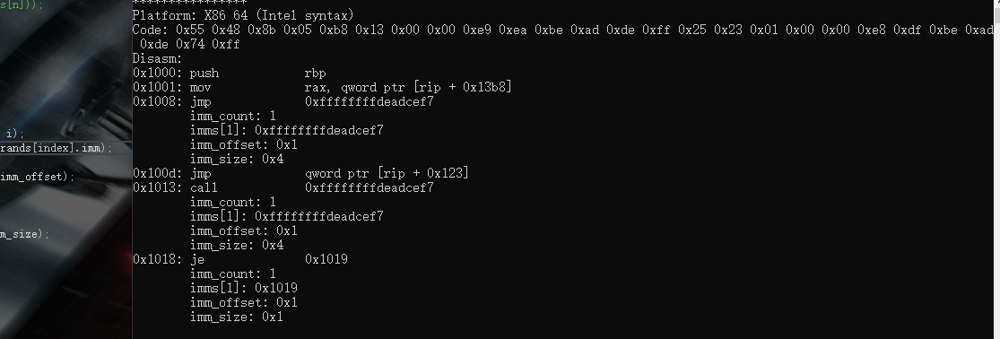


### cs_regs_access

```cpp
cs_err CAPSTONE_API cs_regs_access(csh handle, const cs_insn *insn,
		cs_regs regs_read, uint8_t *regs_read_count,
		cs_regs regs_write, uint8_t *regs_write_count);
```

检索由一条指令显式或隐式访问的所有寄存器

注意： 在“diet”模式下，此API不可用，因为引擎不存储寄存器

```
handle: cs_open()返回的句柄
insn: 从cs_disasm()或cs_disasm_iter()返回的反汇编指令结构
regs_read:返回时，这个数组包含所有按指令读取的寄存器。
regs_read_count:保存在regs_read数组中的寄存器数。
regs_write:返回时，这个数组包含所有由指令修改的寄存器。
regs_write_count:保存在regs_write数组中的寄存器数。
成功时返回CS_ERR_OK，失败时返回其他值(详细错误请参阅cs_err enum)。
```

<details><summary> 源码实现 </summary>

```cpp
cs_err CAPSTONE_API cs_regs_access(csh ud, const cs_insn *insn,
		cs_regs regs_read, uint8_t *regs_read_count,
		cs_regs regs_write, uint8_t *regs_write_count)
{
	struct cs_struct *handle;

	if (!ud)
		return -1;

	handle = (struct cs_struct *)(uintptr_t)ud;

#ifdef CAPSTONE_DIET
	// This API does not work in DIET mode
	handle->errnum = CS_ERR_DIET;
	return CS_ERR_DIET;
#else
	if (!handle->detail) {
		handle->errnum = CS_ERR_DETAIL;
		return CS_ERR_DETAIL;
	}

	if (!insn->id) {
		handle->errnum = CS_ERR_SKIPDATA;
		return CS_ERR_SKIPDATA;
	}

	if (!insn->detail) {
		handle->errnum = CS_ERR_DETAIL;
		return CS_ERR_DETAIL;
	}

	if (handle->reg_access) {
		handle->reg_access(insn, regs_read, regs_read_count, regs_write, regs_write_count);
	} else {
		// this arch is unsupported yet
		handle->errnum = CS_ERR_ARCH;
		return CS_ERR_ARCH;
	}

	return CS_ERR_OK;
#endif
}
```

</details>


<details><summary> 示例 </summary>

```cpp
#include <iostream>
#include <stdio.h>

#include "capstone.h"
#include "platform.h"

using namespace std;

struct platform {
	cs_arch arch;
	cs_mode mode;
	unsigned char* code;
	size_t size;
	const char* comment;
	cs_opt_type opt_type;
	cs_opt_value opt_value;
};

static void print_string_hex(unsigned char* str, size_t len)
{
	unsigned char* c;

	printf("Code: ");
	for (c = str; c < str + len; c++) {
		printf("0x%02x ", *c & 0xff);
	}
	printf("\n");
}

static void test()
{
#define X86_CODE64 "\x55\x48\x8b\x05\xb8\x13\x00\x00\xe9\xea\xbe\xad\xde\xff\x25\x23\x01\x00\x00\xe8\xdf\xbe\xad\xde\x74\xff"
	struct platform platforms[] = {
		{
			CS_ARCH_X86,
			CS_MODE_64,
			(unsigned char*)X86_CODE64,
			sizeof(X86_CODE64) - 1,
			"X86 64 (Intel syntax)"
		},
	};

	csh handle;
	uint64_t address;
	cs_insn* insn;
	cs_detail* detail;
	int i;
	cs_err err;
	const uint8_t* code;
	size_t size;

	cs_x86* x86;
	cs_regs regs_read, regs_write;
	uint8_t regs_read_count, regs_write_count;
	
	int count;

	for (i = 0; i < sizeof(platforms) / sizeof(platforms[0]); i++) {
		printf("****************\n");
		printf("Platform: %s\n", platforms[i].comment);
		err = cs_open(platforms[i].arch, platforms[i].mode, &handle);
		if (err) {
			printf("Failed on cs_open() with error returned: %u\n", err);
			abort();
		}

		if (platforms[i].opt_type)
			cs_option(handle, platforms[i].opt_type, platforms[i].opt_value);

		cs_option(handle, CS_OPT_DETAIL, CS_OPT_ON);

		insn = cs_malloc(handle);
		x86 = &(insn->detail->x86);
		print_string_hex(platforms[i].code, platforms[i].size);
		printf("Disasm:\n");

		address = 0x1000;
		code = platforms[i].code;
		size = platforms[i].size;
		while (cs_disasm_iter(handle, &code, &size, &address, insn)) {
			int n;

			printf("0x%" PRIx64 ":\t%s\t\t%s          ",
				insn->address, insn->mnemonic, insn->op_str);
			cout << endl;

			if (!cs_regs_access(handle, insn,       //每条指令所有读取和修改的寄存器
				regs_read, &regs_read_count,
				regs_write, &regs_write_count)) {
				if (regs_read_count) {
					printf("\tRegisters read:");
					for (i = 0; i < regs_read_count; i++) {
						printf(" %s", cs_reg_name(handle, regs_read[i]));
					}
					printf("\n");
				}

				if (regs_write_count) {
					printf("\tRegisters modified:");
					for (i = 0; i < regs_write_count; i++) {
						printf(" %s", cs_reg_name(handle, regs_write[i]));
					}
					printf("\n");
				}
			}
		}

		printf("\n");
		cs_free(insn, 1);
		cs_close(&handle);
	}
}

int main()
{
	test();
	return 0;
}
```

</details>

输出

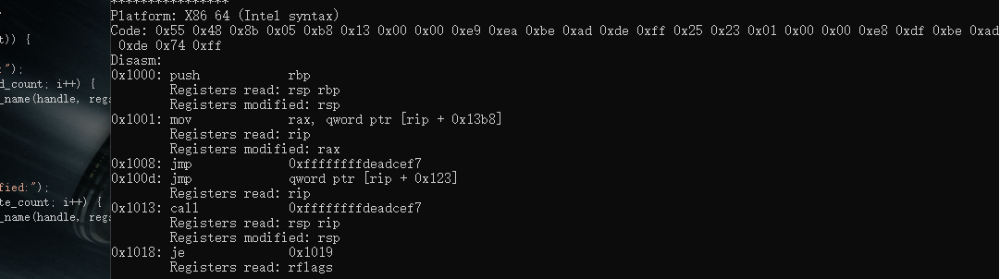
